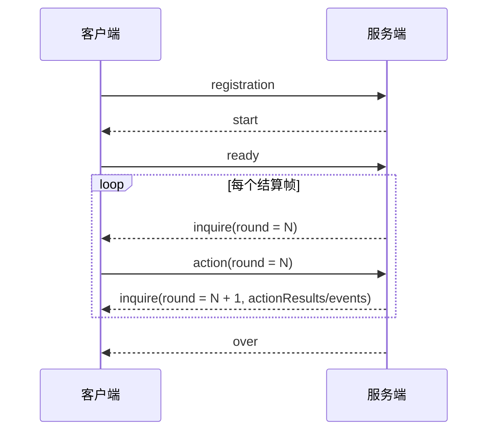

# 《一骑红尘：荔枝争运战》通信协议

| 协议                               | 日期       | 作者   |
| ---------------------------------- | ---------- | ------ |
| 《一骑红尘：荔枝争运战》通信协议V1 | 2026-06-22 | 王明海 |
| 《一骑红尘：荔枝争运战》通信协议V2 | 2026-06-27 | 刘磊   |
| 《一骑红尘：荔枝争运战》通信协议V3 | 2026-06-30 | 刘磊   |

---

# 快速接入（先读这一章）

本章只解决一个问题：客户端如何最快和服务端跑通通信。第一次接入时，建议按下面顺序阅读；后续需要查完整字段时，再看后面的详细章节。

| 阅读目标 | 先看章节 | 读完能做什么 |
| --- | --- | --- |
| 建立 TCP 连接 | 第 1 章 | 正确处理 5 位长度前缀、半包和粘包 |
| 跑通消息流程 | 第 2 章 | 完成 `registration -> start -> ready -> inquire/action -> over` |
| 读取开局地图 | 第 5 章 | 缓存 `matchId`、本方阵营、`nodes[]`、`edges[]`、资源和任务模板 |
| 每帧发动作 | 第 8 章 | 按 `inquire.round` 提交 `action.round` |
| 判断动作结果 | 第 10 章 / 附录 F | 通过 `events[]`、`actionResults[]` 和下一帧状态判断动作是否生效 |
| 排查错误 | 第 11 章 | 根据错误码修正客户端发包或策略 |

最小客户端循环：

```text
1. 连接服务端 TCP。
2. 发送 registration。
3. 收到 start，保存 matchId；从 players[] 识别本方 playerId/teamId；缓存 nodes、edges。
4. 发送 ready，round 固定填 1。
5. 收到 inquire.round = N。
6. 计算动作，发送 action.round = N。
7. 下一帧 inquire 里读取上一帧 events[] / actionResults[]。
8. 收到 over 后结束。
```

真实 TCP 帧格式：

```text
5 位十进制长度前缀 + UTF-8 JSON body
```

真实发送时，必须先把 JSON body 序列化成 UTF-8 字节，再计算 5 位长度前缀。后续章节里的多行 JSON 示例只展示 body，不包含长度前缀。

单行 TCP 帧示例：

```text
00104{"msg_name":"action","msg_data":{"matchId":"match_20260627_001","round":1,"playerId":1001,"actions":[]}}
```

最小 action 示例：

```json
{
  "msg_name": "action",
  "msg_data": {
    "matchId": "match_20260627_001",
    "round": 12,
    "playerId": 1001,
    "actions": [
      {
        "action": "MOVE",
        "targetNodeId": "S03"
      }
    ]
  }
}
```

没有主动动作时也要发送空动作心跳：

```json
{
  "msg_name": "action",
  "msg_data": {
    "matchId": "match_20260627_001",
    "round": 12,
    "playerId": 1001,
    "actions": []
  }
}
```

判断动作是否生效：

| 看什么 | 作用 |
| --- | --- |
| `error` | 当前消息包没有进入规则结算，先修正发包 |
| `events[]` | 看服务端真实发生了什么，例如到站、领取成功、窗口创建、动作拒绝 |
| `actionResults[]` | 看上一帧动作包的汇总结果 |
| 下一帧 `players[]` / `nodes[]` / `tasks[]` | 看本方位置、库存、任务、窗口等状态是否变化 |

不要只看 `actionResults.accepted = true` 就认为一定拿到收益。读条类动作、窗口争夺类动作和移动类动作通常要结合下一帧状态继续判断。

---

# 1. 通信方式

## 正式比赛采用

```text
采用C/S方式交互，对战过程包含1个服务端和多个客户端，服务端由主办方提供，客户端由参战队伍提供。
客户端与服务端之间，通过TCP Socket通讯。
客户端Socket通信一次收包可能收不全（需处理粘包、分包问题），参赛队伍请务必考虑此场景，避免因收包未收全直接处理消息而导致掉线。
```

## TCP 拆包/粘包处理要求

TCP 是字节流。客户端和服务端都按 5 位长度前缀拆帧。

消息格式：

```text
5 位十进制长度前缀 + UTF-8 JSON body
示例：00123{"msg_name":"inquire","msg_data":{...}}
```

接收方必须做到：

| 场景 | 要求 |
| --- | --- |
| 半包 | 先缓存字节，等完整 body 收齐再解析 |
| 粘包 | 按 5 位长度前缀循环拆出多条消息 |
| 中文跨包 | 先按字节缓存，完整后再 UTF-8 解码 |
| 大消息 | `start`、`inquire`、`over` 都可能被拆包 |

服务端已按字节流处理客户端上行消息。客户端也必须按相同规则处理服务端下发消息。

推荐做法：

```text
ByteBuf -> 按长度前缀拆帧 -> UTF-8 解码 -> JSON 解析
```

不要这样做：

```text
StringDecoder -> 直接 JSON.parseObject(channelRead 收到的字符串)
```

长度规则：

| 规则 | 说明 |
| --- | --- |
| 长度前缀 | 固定 5 个 ASCII 数字 |
| 长度含义 | JSON body 的 UTF-8 字节数 |
| 最大长度 | 99999 字节 |
| 中文内容 | 可能是原始 UTF-8，也可能是 `\uXXXX` 转义 |
| 消息边界 | 只能按长度前缀判断，不能按换行、缓冲区大小或 read 次数判断 |

# 2. 消息流程

消息流程图：



结算帧怎么提交：

```text
客户端收到 inquire.round = N 后，就提交 action.round = N。
这组 action 参与 round N 的服务端结算。
round N 的处理结果，会在下一次 inquire 的 actionResults 和 events 中下发。
```

最小客户端收发流程：

| 步骤 | 客户端处理 | 关键点 |
|---:|---|---|
| 1 | 建立 TCP 长连接 | 按第 1 章处理 5 位长度前缀 |
| 2 | 发送 `registration` | 提交 `playerId`、`playerName`、`version` |
| 3 | 接收 `start` | 缓存 `matchId`、自身阵营、地图、资源和任务模板 |
| 4 | 发送 `ready` | `matchId` 必须等于 `start.matchId`，`round` 填 1 |
| 5 | 接收 `inquire` | 使用 `inquire.round` 决策本帧动作 |
| 6 | 发送 `action` | 即使没有主动动作，也发送 `actions: []` |
| 7 | 循环处理 `inquire` | 先看 `events[]`，再看 `actionResults[]` 和状态字段 |
| 8 | 接收 `over` | 读取最终胜负和分项得分 |

下面示例只展示客户端需要主动发送的 JSON body，不包含 5 位长度前缀。真实发送前，客户端必须按第 1 章重新计算长度前缀。

服务端下发的 `start` 和 `inquire` 字段较多，本章不重复展开：

- `start`：见第 5 章，客户端从中保存 `matchId`、玩家阵营、地图、资源和任务模板。
- `inquire`：见第 7 章，客户端每帧读取 `round`、状态、事件和动作结果。

1. Client -> Server：注册队伍

```json
{
  "msg_name": "registration",
  "msg_data": {
    "playerId": 1001,
    "playerName": "demo-red",
    "version": "1.0"
  }
}
```

2. Client -> Server：收到 `start` 后发送 ready

```json
{
  "msg_name": "ready",
  "msg_data": {
    "matchId": "match_20260627_001",
    "round": 1,
    "playerId": 1001
  }
}
```

3. Client -> Server：收到 `inquire.round = N` 后发送 action

没有主动动作时：

```json
{
  "msg_name": "action",
  "msg_data": {
    "matchId": "match_20260627_001",
    "round": 1,
    "playerId": 1001,
    "actions": []
  }
}
```

有主动动作时：

```json
{
  "msg_name": "action",
  "msg_data": {
    "matchId": "match_20260627_001",
    "round": 2,
    "playerId": 1001,
    "actions": [
      {
        "action": "MOVE",
        "targetNodeId": "S02"
      }
    ]
  }
}
```

注意：`action.round` 必须等于刚收到的 `inquire.round`。不要在未收到下一帧 `inquire` 时提前发送未来回合动作。

---

# 3. 通用消息格式

客户端需要重点处理 4 类服务端下发消息：

1. `start`
2. `inquire`
3. `over`
4. `error`

所有网络消息的 JSON 外层统一为：

| 字段 | 类型 | 中文名 | 说明 |
| ---------- | --- | -------- | -------------------------------------------- |
| `msg_name` | String | 消息名称 | 用来区分 `start`、`inquire`、`over`、`error` |
| `msg_data` | Object | 消息内容 | 真正的业务数据对象 |

通用 JSON 外层：

```json
{
  "msg_name": "inquire",
  "msg_data": {}
}
```

长度前缀规则见第 1 章，本章只说明 JSON 外层结构。

通用字段规则：

| 规则项 | 要求 |
|---|---|
| 外层结构 | 使用 `msg_name` 和 `msg_data` |
| 大小写 | 字段名和枚举值大小写敏感 |
| 客户端发送 | 必填字段必须传；可选字段可省略 |
| 空动作 | 没有主动动作时传 `actions: []` |
| 未列字段 | 不得依赖未列字段推导规则 |

字段细节见第 7 章 `inquire`、第 8 章 `action`、第 10 章 `actionResults`、附录 F `events[]`。

---

# 4. registration

触发时机：客户端应在连接服务端成功后发此消息

作用：registration 消息用于客户端向服务端注册自己的队伍Id和队名

示例：

```json
{
  "msg_name": "registration",
  "msg_data": {
    "playerId": 1111,
    "playerName": "岭南贡队",
    "version": "1.0"
  }
}
```

registration 字段说明：

| 字段 | 类型 | 是否必传 | 中文名 | 说明 |
| --- | --- | --- | --- | --- |
| playerId | Int | 是 | 玩家编号 | 参赛队伍唯一编号；后续 `ready` 和 `action` 必须使用同一个值 |
| playerName | String | 是 | 队伍名称 | 报名时提交的参赛队伍名称；用于识别队伍，不参与规则结算 |
| version | String | 是 | 客户端版本 | 参赛程序版本号，用于连接诊断 |

registration 连接规则：

```text
1. 当前服务端固定一局两名真实客户端对战，只在比赛 IDLE（空闲） 阶段接受 registration。
2. 比赛开始后再次发送 registration 不会重新绑定队伍；当前实时协议不承诺比赛中断线重连。
3. 连接断开后，服务端会把该队伍标记为离线，并按失联动作、退赛和 over 规则继续结算。
```

---

# 5. start

触发时机：双方客户端完成 `registration` 后，服务端向双方下发。

作用：告诉客户端本局对局编号、双方阵营、地图、路线、资源初始配置、任务模板等静态信息。

客户端关注：寻路、资源和任务策略都应基于本局下发的地图，不要写死节点路线。

示例：这里只展示客户端必须先缓存的关键字段，完整字段以本章字段表为准。

```json
{
  "msg_name": "start",
  "msg_data": {
    "matchId": "match_001",
    "rulesVersion": "4.1",
    "round": 1,
    "durationRound": 600,
    "map": {
      "mapId": "litchi_map_medium_a",
      "maxX": 80,
      "maxY": 60,
      "gameplay": {
        "roles": {
          "startNodeId": "S01",
          "terminalNodeIds": ["S15"],
          "gateNodeId": "S14"
        }
      }
    },
    "players": [
      {"playerId": 1111, "camp": 0, "teamId": "RED"},
      {"playerId": 2222, "camp": 1, "teamId": "BLUE"}
    ],
    "nodes": [
      {"nodeId": "S01", "type": "START", "x": 4, "y": 30},
      {"nodeId": "S15", "type": "TERMINAL", "x": 76, "y": 30}
    ],
    "edges": [
      {"edgeId": "E01", "fromNodeId": "S01", "toNodeId": "S02", "routeType": "ROAD", "distance": 8}
    ],
    "resources": [
      {"nodeId": "S07", "resourceType": "SHORT_HORSE", "count": 1}
    ],
    "taskTemplates": [
      {"taskTemplateId": "T04", "processType": "CLEAR_OBSTACLE", "score": 30}
    ]
  }
}
```

`start` 消息字段较多，是为了同时兼容客户端、地图展示和回放工具。客户端不需要解析所有字段，只需要读取本章标注的玩法决策字段；未使用的展示字段可以忽略。

客户端最小解析范围：

| 必读字段 | 用途 |
| --- | --- |
| `msg_data.matchId` | 后续 `ready`、`action` 必须原样回传 |
| `msg_data.durationRound` | 判断比赛总回合、宫宴冲刺和时间收益 |
| `msg_data.players[]` | 识别本方 `playerId`、阵营和对手 |
| `msg_data.nodes[]` | 读取站点、坐标、节点类型 |
| `msg_data.edges[]` | 寻路、判断相邻点、计算路线类型和距离 |
| `msg_data.resources[]` | 初始化资源投放点、资源类型和领取读条 |
| `msg_data.taskTemplates[]` | 初始化皇榜任务模板、候选点、读条和分值 |
| `msg_data.map.gameplay.roles` | 识别起点、终点、宫门、安全区等语义点 |
| `msg_data.map.gameplay.routeTaskBuckets` | 判断三条路线和支路的任务归属 |

字段重复时的读取口径：

| 情况 | 策略客户端口径 |
| --- | --- |
| `msg_data.nodes[]` 与 `msg_data.map.nodes[]` 重复 | 优先读取顶层 `msg_data.nodes[]` |
| `msg_data.edges[]` 与 `msg_data.map.edges[]` 重复 | 优先读取顶层 `msg_data.edges[]` |
| `msg_data.routePaths[]` / `msg_data.map.routePaths[]` | 主要用于地图展示和回放渲染，客户端忽略 |
| `msg_data.map.layers` | 仅用于地图展示和回放渲染，客户端忽略 |
| `msg_data.map.weatherRegionRule` | 主要用于地图展示和回放渲染；天气实际影响以每帧 `inquire.weather` 为准 |

下面是字段说明，客户端按字段表解析真实下发内容。

## start.msg_data 字段

| 字段 | 类型 | 中文名 | 说明 |
| --- | --- | --- | --- |
| matchId | String | 对局编号 | 本局唯一标识；客户端后续 `ready` 和 `action` 必须原样回传 |
| rulesVersion | String | 规则版本 | 协议和规则配置版本 |
| seedHash | String | 随机种子摘要 | 用于赛后校验；实时协议不下发完整 `seed` |
| round | Int | 起始结算帧 | 通常为 1；客户端 `ready.round` 使用该值 |
| tick | Int | 帧序号 | 当前 start 固定为 0；规则判断使用 `round` |
| durationRound | Int | 最大持续回合数 | 当前为 600 |
| map | Object | 地图配置回显 | 包含展示层与 gameplay 配置；策略优先读取顶层 `nodes/edges/resources/taskTemplates` 和 `map.gameplay` |
| players | Array<Object> | 开局玩家列表 | 包含 playerId、红蓝方和队伍名称 |
| nodes | Array<Object> | 静态站点列表 | 本局地图站点，客户端不要硬编码站点 |
| edges | Array<Object> | 静态路线边列表 | 判断能否移动、路线类型、移动距离 |
| routePaths | Array<Object> | 路线渲染折线 | 前端/回放绘制数据；策略客户端寻路以 `edges[]` 为准，可忽略 |
| resources | Array<Object> | 静态资源初始配置 | 本局资源投放点、类型、数量、领取时间 |
| taskTemplates | Array<Object> | 皇榜任务模板 | 静态任务模板；运行时活跃任务以 `inquire.tasks[]` 为准 |

## start.players[] 字段

| 字段 | 类型 | 中文名 | 说明 |
| --- | --- | --- | --- |
| playerId | Int | 玩家ID | 唯一标识客户端队伍 |
| camp | Int | 阵营数字 | 服务端内部阵营编号 |
| teamId | String | 红蓝方 | `RED` / `BLUE` 枚举，只表示阵营方位，不是玩家编号； |
| name | String | 玩家名称 | 参赛队伍名称； |

---

## start.map 字段

| 字段 | 类型 | 中文名 | 说明 |
| ------------------- | --- | ---------------- | -------------------------------------------------- |
| `schemaVersion` | String | 地图结构版本 | 地图配置格式版本 |
| `mapId` | String | 地图 ID | 当前地图唯一标识 |
| `mapName` | String | 地图名称 | 当前地图展示名称 |
| `designVersion` | String | 地图设计版本 | 地图设计迭代版本 |
| `mapConfigFile` | String | 地图配置文件名 | 服务端加载的地图配置来源 |
| `data` | String | 地图载荷 | 地图网格或展示数据；策略通常读取 `nodes`、`edges`、`gameplay` |
| `maxX` | Int | 地图 X 轴宽度 | 前端渲染坐标范围 |
| `maxY` | Int | 地图 Y 轴高度 | 前端渲染坐标范围 |
| `nodes` | Array<Object> | 地图站点列表 | 与顶层 `start.nodes` 描述同一批站点；策略优先读取顶层字段 |
| `edges` | Array<Object> | 地图路线边列表 | 与顶层 `start.edges` 描述同一批路线；策略优先读取顶层字段 |
| `gameplay` | Object | 地图玩法绑定 | 地图上的起点、终点、宫门、资源点、任务点等玩法语义 |

## start.map.weatherRegionRule 字段

`start.map.weatherRegionRule` 主要用于地图展示和回放渲染；策略客户端判断天气影响时，以每帧 `inquire.weather` 为准。

## start.map.layers 字段

`start.map.layers` 仅用于地图展示和回放渲染，客户端忽略。

## start.map.gameplay 字段

| 字段 | 类型 | 中文名 | 说明 |
| -------------------------- | --- | ------------ | ------------------------------------------------------------ |
| `roles` | Object | 地图角色点位 | 起点、终点、宫门、安全区等 |
| `resources` | Array<Object> | 资源库存点位 | 地图覆盖的资源投放配置 |
| `processNodes` | Array<Object> | 可处理站点 | 地图覆盖的读条处理点配置 |
| `taskCandidates` | Map<String, Array<String>> | 任务候选点 | key 为任务模板 ID，value 为候选站点 ID 列表 |
| `routeTaskBuckets` | Map<String, Array<String>> | 路线任务桶 | key 为 `ROAD/WATER/MOUNTAIN/BRANCH`，value 为该路线可刷任务点 |
| `obstacleCandidateNodeIds` | Array<String> | 障碍候选点 | 可生成障碍的站点 ID 列表 |

## start.map.gameplay.resources[] 字段

| 字段 | 类型 | 中文名 | 说明 |
| -------------- | --- | --------------- | ------------------------------------ |
| `nodeId` | String | 资源所在站点 ID | 该资源投放在哪个站点 |
| `resourceType` | String | 资源类型 | 例如冰鉴、马匹、船权、情报、通行令等 |
| `count` | Int | 初始数量 | 该资源初始库存 |
| `claimRound` | Int | 领取回合数 | 领取该资源需要处理多少回合 |

## start.map.gameplay.processNodes[] 字段

| 字段 | 类型 | 中文名 | 说明 |
| -------------- | --- | ---------------- | ------------------------------------- |
| `nodeId` | String | 流程站点 ID | 哪个站点有额外流程处理 |
| `processType` | String | 流程类型 | 例如换乘、登船、宫门验核等 |
| `processRound` | Int | 处理回合数 | 完成该流程需要等待多少回合 |
| `canWindow` | Boolean | 是否允许窗口争夺 | `true` 表示该流程节点可能进入窗口争夺 |

## start.map.gameplay.taskCandidates 字段

| 字段 | 类型 | 中文名 | 说明 |
| -------- | --- | ---------------- | ------------------------ |
| 动态 key | String | 任务模板 ID | 例如 `T01`、`T08` |
| value | Array<String> | 候选站点 ID 列表 | 该任务可能刷新在哪些站点 |

## start.map.gameplay.routeTaskBuckets 字段

| 字段 | 类型 | 中文名 | 说明 |
| -------- | --- | ---------------- | ------------------------------------------ |
| 动态 key | String | 路线类型 | 例如 `ROAD`、`WATER`、`MOUNTAIN`、`BRANCH` |
| value | Array<String> | 路线任务站点列表 | 该路线可参与任务分布和路线收益统计的站点 |

## start.map.gameplay.obstacleCandidateNodeIds[] 字段

| 字段 | 类型 | 中文名 | 说明 |
| ------ | --- | --------------- | ---------------------------------------- |
| 数组项 | Array<String> | 障碍候选站点 ID | 服务端可在这些站点生成或处理障碍相关玩法 |

## start.map.gameplay.roles 字段

| 字段 | 类型 | 中文名 | 说明 |
| --------------------- | --- | ---------------------- | ---------------------------------- |
| `startNodeId` | String | 起点站点 ID | 主车队初始站点 |
| `terminalNodeIds` | Array<String> | 终点站点 ID 列表 | 可交付终点 |
| `gateNodeId` | String | 宫门站点 ID | 需要验核的宫门 |
| `safeZoneNodeIds` | Array<String> | 安全区站点 ID 列表 | 安全区内部分动作会受限制 |
| `reverifyNodeId` | String | 重新验核站点 ID | 安全区重验核相关站点 |
| `rushExcludedNodeIds` | Array<String> | 宫宴冲刺提前触发排除点 | 判断冲刺阶段剩余距离时可排除的点位 |

start.map.gameplay 简例：

```json
{
  "roles": {
    "startNodeId": "S01",
    "gateNodeId": "S14",
    "terminalNodeIds": ["S15"],
    "safeZoneNodeIds": ["S15"]
  },
  "resources": [
    {
      "nodeId": "S07",
      "resourceType": "SHORT_HORSE",
      "count": 1,
      "claimRound": 2
    }
  ],
  "taskCandidates": {
    "T01": ["S06", "S08"]
  },
  "routeTaskBuckets": {
    "ROAD": ["S06", "S10"],
    "WATER": ["S04", "S09"]
  }
}
```

## start.nodes[] 字段

| 字段 | 类型 | 中文名 | 说明 |
| ---------- | --- | ------------ | --------------------------------------- |
| `nodeId` | String | 站点 ID | 例如 `S01`、`S14` |
| `code` | String | 地图节点编码 | 地图配置里的数字编码 |
| `name` | String | 站点名称 | 展示用 |
| `x` | Int | 横坐标 | 地图渲染用 |
| `y` | Int | 纵坐标 | 地图渲染用 |
| `type` | String | 站点类型 | 与 `nodeType` 互相同步 |
| `icon` | String | 地图图标标识 | 前端展示用 |
| `nodeType` | String | 站点类型 | 如 `START`、`DOCK`、`GATE`、`FINISH` 等 |
| `start` | Boolean | 是否起点 | `true` 表示起点 |
| `terminal` | Boolean | 是否终点 | `true` 表示可交付终点 |

## start.edges[] 字段

| 字段 | 类型 | 中文名 | 说明 |
| --------------- | --- | --------------- | ---------------------------------------- |
| `edgeId` | String | 路线边 ID | 路线唯一标识 |
| `fromNode` | String | 起点站点 ID | 路线起点 |
| `toNode` | String | 终点站点 ID | 路线终点 |
| `fromNodeId` | String | 起点站点别名 ID | 与 `fromNode` 同步 |
| `toNodeId` | String | 终点站点别名 ID | 与 `toNode` 同步 |
| `routeType` | String | 路线类型 | 如 `ROAD`、`WATER`、`MOUNTAIN`、`BRANCH` |
| `distance` | Int | 逻辑距离 | 服务端移动耗时计算基础 |
| `bidirectional` | Boolean | 是否双向通行 | `true` 表示双向可走 |
| `pathId` | String | 路径 ID | 用于归类路线或渲染路径 |

## start.routePaths[] / start.map.routePaths[] 字段

`start.routePaths[]` / `start.map.routePaths[]` 主要用于地图展示和回放渲染；客户端寻路应以 `start.edges[]` 和 `inquire.edges[]` 为准。

## start.resources[] 字段

| 字段 | 类型 | 中文名 | 说明 |
| -------------- | --- | --------------- | -------------------------- |
| `nodeId` | String | 资源所在站点 ID | 资源投放在哪个站点 |
| `resourceType` | String | 资源类型 | 如马匹、冰鉴、船权等 |
| `count` | Int | 初始数量 | 该资源初始库存 |
| `claimRound` | Int | 领取读条回合数 | 领取该资源需要处理多少回合 |

## start.taskTemplates[] 字段

| 字段 | 类型 | 中文名 | 说明 |
| ----------------------- | --- | ---------------- | ------------------------ |
| `taskTemplateId` | String | 任务模板 ID | 任务模板唯一标识 |
| `name` | String | 任务名称 | 展示用 |
| `candidateNodeIds` | Array<String> | 候选站点 ID 列表 | 该任务可能刷在哪些站点 |
| `processType` | String | 任务处理类型 | 完成任务时对应的处理类型 |
| `processRound` | Int | 处理回合数 | 完成任务读条需要多少回合 |
| `requiredFreshness` | Number | 要求鲜度 | 鲜度低于该值可能无法完成 |
| `requiredResourceTypes` | Array<String> | 要求资源类型列表 | 完成任务需要持有的资源 |
| `score` | Int | 任务分值 | 完成后获得的任务分 |

# 6. ready

触发时机：用于客户端在收到start消息处理完成后触发

作用：回复准备完成消息给服务端

示例：

```json
{
  "msg_name": "ready",
  "msg_data": {
    "matchId": "match_001",
    "round": 1,
    "playerId": 1111
  }
}
```