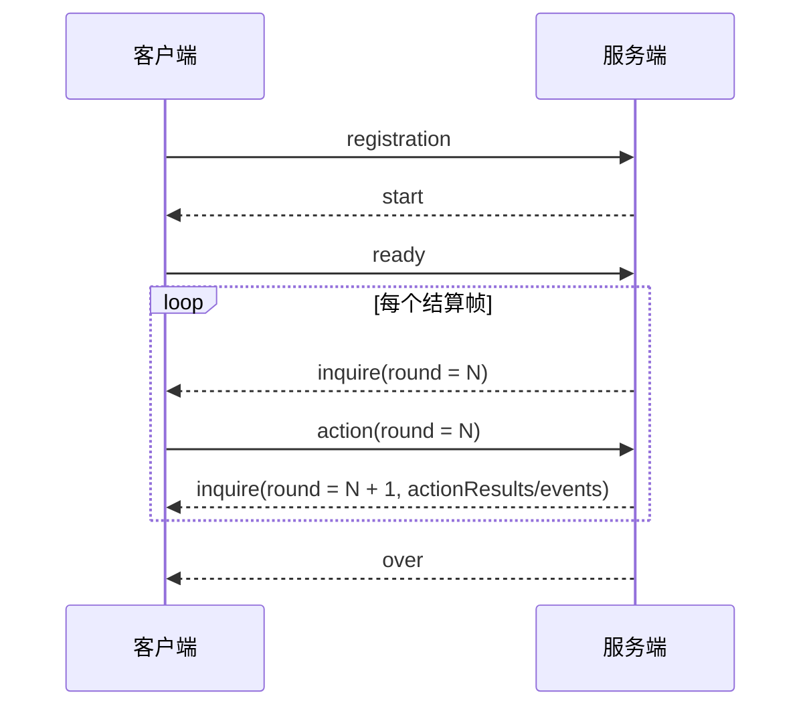

# 《一骑红尘：荔枝争运战》通信协议

| 协议                               | 日期       | 作者   |
| ---------------------------------- | ---------- | ------ |
| 《一骑红尘：荔枝争运战》通信协议V1 | 2026-06-22 | 王明海 |
| 《一骑红尘：荔枝争运战》通信协议V2 | 2026-06-27 | 刘磊   |
| 《一骑红尘：荔枝争运战》通信协议V3 | 2026-06-30 | 刘磊   |

---

# 快速接入（先读这一章）

本章只解决一个问题：客户端如何最快和服务端跑通通信。第一次接入时，建议按下面顺序阅读；后续需要查完整字段时，再看后面的详细章节。

| 阅读目标 | 先看章节 | 读完能做什么 |
| --- | --- | --- |
| 建立 TCP 连接 | 第 1 章 | 正确处理 5 位长度前缀、半包和粘包 |
| 跑通消息流程 | 第 2 章 | 完成 `registration -> start -> ready -> inquire/action -> over` |
| 读取开局地图 | 第 5 章 | 缓存 `matchId`、本方阵营、`nodes[]`、`edges[]`、资源和任务模板 |
| 每帧发动作 | 第 8 章 | 按 `inquire.round` 提交 `action.round` |
| 判断动作结果 | 第 10 章 / 附录 F | 通过 `events[]`、`actionResults[]` 和下一帧状态判断动作是否生效 |
| 排查错误 | 第 11 章 | 根据错误码修正客户端发包或策略 |

最小客户端循环：

```text
1. 连接服务端 TCP。
2. 发送 registration。
3. 收到 start，保存 matchId；从 players[] 识别本方 playerId/teamId；缓存 nodes、edges。
4. 发送 ready，round 固定填 1。
5. 收到 inquire.round = N。
6. 计算动作，发送 action.round = N。
7. 下一帧 inquire 里读取上一帧 events[] / actionResults[]。
8. 收到 over 后结束。
```

真实 TCP 帧格式：

```text
5 位十进制长度前缀 + UTF-8 JSON body
```

真实发送时，必须先把 JSON body 序列化成 UTF-8 字节，再计算 5 位长度前缀。后续章节里的多行 JSON 示例只展示 body，不包含长度前缀。

单行 TCP 帧示例：

```text
00104{"msg_name":"action","msg_data":{"matchId":"match_20260627_001","round":1,"playerId":1001,"actions":[]}}
```

最小 action 示例：

```json
{
  "msg_name": "action",
  "msg_data": {
    "matchId": "match_20260627_001",
    "round": 12,
    "playerId": 1001,
    "actions": [
      {
        "action": "MOVE",
        "targetNodeId": "S03"
      }
    ]
  }
}
```

没有主动动作时也要发送空动作心跳：

```json
{
  "msg_name": "action",
  "msg_data": {
    "matchId": "match_20260627_001",
    "round": 12,
    "playerId": 1001,
    "actions": []
  }
}
```

判断动作是否生效：

| 看什么 | 作用 |
| --- | --- |
| `error` | 当前消息包没有进入规则结算，先修正发包 |
| `events[]` | 看服务端真实发生了什么，例如到站、领取成功、窗口创建、动作拒绝 |
| `actionResults[]` | 看上一帧动作包的汇总结果 |
| 下一帧 `players[]` / `nodes[]` / `tasks[]` | 看本方位置、库存、任务、窗口等状态是否变化 |

不要只看 `actionResults.accepted = true` 就认为一定拿到收益。读条类动作、窗口争夺类动作和移动类动作通常要结合下一帧状态继续判断。

---

# 1. 通信方式

## 正式比赛采用

```text
采用C/S方式交互，对战过程包含1个服务端和多个客户端，服务端由主办方提供，客户端由参战队伍提供。
客户端与服务端之间，通过TCP Socket通讯。
客户端Socket通信一次收包可能收不全（需处理粘包、分包问题），参赛队伍请务必考虑此场景，避免因收包未收全直接处理消息而导致掉线。
```

## TCP 拆包/粘包处理要求

TCP 是字节流。客户端和服务端都按 5 位长度前缀拆帧。

消息格式：

```text
5 位十进制长度前缀 + UTF-8 JSON body
示例：00123{"msg_name":"inquire","msg_data":{...}}
```

接收方必须做到：

| 场景 | 要求 |
| --- | --- |
| 半包 | 先缓存字节，等完整 body 收齐再解析 |
| 粘包 | 按 5 位长度前缀循环拆出多条消息 |
| 中文跨包 | 先按字节缓存，完整后再 UTF-8 解码 |
| 大消息 | `start`、`inquire`、`over` 都可能被拆包 |

服务端已按字节流处理客户端上行消息。客户端也必须按相同规则处理服务端下发消息。

推荐做法：

```text
ByteBuf -> 按长度前缀拆帧 -> UTF-8 解码 -> JSON 解析
```

不要这样做：

```text
StringDecoder -> 直接 JSON.parseObject(channelRead 收到的字符串)
```

长度规则：

| 规则 | 说明 |
| --- | --- |
| 长度前缀 | 固定 5 个 ASCII 数字 |
| 长度含义 | JSON body 的 UTF-8 字节数 |
| 最大长度 | 99999 字节 |
| 中文内容 | 可能是原始 UTF-8，也可能是 `\uXXXX` 转义 |
| 消息边界 | 只能按长度前缀判断，不能按换行、缓冲区大小或 read 次数判断 |

# 2. 消息流程

消息流程图：



结算帧怎么提交：

```text
客户端收到 inquire.round = N 后，就提交 action.round = N。
这组 action 参与 round N 的服务端结算。
round N 的处理结果，会在下一次 inquire 的 actionResults 和 events 中下发。
```

最小客户端收发流程：

| 步骤 | 客户端处理 | 关键点 |
|---:|---|---|
| 1 | 建立 TCP 长连接 | 按第 1 章处理 5 位长度前缀 |
| 2 | 发送 `registration` | 提交 `playerId`、`playerName`、`version` |
| 3 | 接收 `start` | 缓存 `matchId`、自身阵营、地图、资源和任务模板 |
| 4 | 发送 `ready` | `matchId` 必须等于 `start.matchId`，`round` 填 1 |
| 5 | 接收 `inquire` | 使用 `inquire.round` 决策本帧动作 |
| 6 | 发送 `action` | 即使没有主动动作，也发送 `actions: []` |
| 7 | 循环处理 `inquire` | 先看 `events[]`，再看 `actionResults[]` 和状态字段 |
| 8 | 接收 `over` | 读取最终胜负和分项得分 |

下面示例只展示客户端需要主动发送的 JSON body，不包含 5 位长度前缀。真实发送前，客户端必须按第 1 章重新计算长度前缀。

服务端下发的 `start` 和 `inquire` 字段较多，本章不重复展开：

- `start`：见第 5 章，客户端从中保存 `matchId`、玩家阵营、地图、资源和任务模板。
- `inquire`：见第 7 章，客户端每帧读取 `round`、状态、事件和动作结果。

1. Client -> Server：注册队伍

```json
{
  "msg_name": "registration",
  "msg_data": {
    "playerId": 1001,
    "playerName": "demo-red",
    "version": "1.0"
  }
}
```

2. Client -> Server：收到 `start` 后发送 ready

```json
{
  "msg_name": "ready",
  "msg_data": {
    "matchId": "match_20260627_001",
    "round": 1,
    "playerId": 1001
  }
}
```

3. Client -> Server：收到 `inquire.round = N` 后发送 action

没有主动动作时：

```json
{
  "msg_name": "action",
  "msg_data": {
    "matchId": "match_20260627_001",
    "round": 1,
    "playerId": 1001,
    "actions": []
  }
}
```

有主动动作时：

```json
{
  "msg_name": "action",
  "msg_data": {
    "matchId": "match_20260627_001",
    "round": 2,
    "playerId": 1001,
    "actions": [
      {
        "action": "MOVE",
        "targetNodeId": "S02"
      }
    ]
  }
}
```

注意：`action.round` 必须等于刚收到的 `inquire.round`。不要在未收到下一帧 `inquire` 时提前发送未来回合动作。

---

# 3. 通用消息格式

客户端需要重点处理 4 类服务端下发消息：

1. `start`
2. `inquire`
3. `over`
4. `error`

所有网络消息的 JSON 外层统一为：

| 字段 | 类型 | 中文名 | 说明 |
| ---------- | --- | -------- | -------------------------------------------- |
| `msg_name` | String | 消息名称 | 用来区分 `start`、`inquire`、`over`、`error` |
| `msg_data` | Object | 消息内容 | 真正的业务数据对象 |

通用 JSON 外层：

```json
{
  "msg_name": "inquire",
  "msg_data": {}
}
```

长度前缀规则见第 1 章，本章只说明 JSON 外层结构。

通用字段规则：

| 规则项 | 要求 |
|---|---|
| 外层结构 | 使用 `msg_name` 和 `msg_data` |
| 大小写 | 字段名和枚举值大小写敏感 |
| 客户端发送 | 必填字段必须传；可选字段可省略 |
| 空动作 | 没有主动动作时传 `actions: []` |
| 未列字段 | 不得依赖未列字段推导规则 |

字段细节见第 7 章 `inquire`、第 8 章 `action`、第 10 章 `actionResults`、附录 F `events[]`。

---

# 4. registration

触发时机：客户端应在连接服务端成功后发此消息

作用：registration 消息用于客户端向服务端注册自己的队伍Id和队名

示例：

```json
{
  "msg_name": "registration",
  "msg_data": {
    "playerId": 1111,
    "playerName": "岭南贡队",
    "version": "1.0"
  }
}
```

registration 字段说明：

| 字段 | 类型 | 是否必传 | 中文名 | 说明 |
| --- | --- | --- | --- | --- |
| playerId | Int | 是 | 玩家编号 | 参赛队伍唯一编号；后续 `ready` 和 `action` 必须使用同一个值 |
| playerName | String | 是 | 队伍名称 | 报名时提交的参赛队伍名称；用于识别队伍，不参与规则结算 |
| version | String | 是 | 客户端版本 | 参赛程序版本号，用于连接诊断 |

registration 连接规则：

```text
1. 当前服务端固定一局两名真实客户端对战，只在比赛 IDLE（空闲） 阶段接受 registration。
2. 比赛开始后再次发送 registration 不会重新绑定队伍；当前实时协议不承诺比赛中断线重连。
3. 连接断开后，服务端会把该队伍标记为离线，并按失联动作、退赛和 over 规则继续结算。
```

---

# 5. start

触发时机：双方客户端完成 `registration` 后，服务端向双方下发。

作用：告诉客户端本局对局编号、双方阵营、地图、路线、资源初始配置、任务模板等静态信息。

客户端关注：寻路、资源和任务策略都应基于本局下发的地图，不要写死节点路线。

示例：这里只展示客户端必须先缓存的关键字段，完整字段以本章字段表为准。

```json
{
  "msg_name": "start",
  "msg_data": {
    "matchId": "match_001",
    "rulesVersion": "4.1",
    "round": 1,
    "durationRound": 600,
    "map": {
      "mapId": "litchi_map_medium_a",
      "maxX": 80,
      "maxY": 60,
      "gameplay": {
        "roles": {
          "startNodeId": "S01",
          "terminalNodeIds": ["S15"],
          "gateNodeId": "S14"
        }
      }
    },
    "players": [
      {"playerId": 1111, "camp": 0, "teamId": "RED"},
      {"playerId": 2222, "camp": 1, "teamId": "BLUE"}
    ],
    "nodes": [
      {"nodeId": "S01", "type": "START", "x": 4, "y": 30},
      {"nodeId": "S15", "type": "TERMINAL", "x": 76, "y": 30}
    ],
    "edges": [
      {"edgeId": "E01", "fromNodeId": "S01", "toNodeId": "S02", "routeType": "ROAD", "distance": 8}
    ],
    "resources": [
      {"nodeId": "S07", "resourceType": "SHORT_HORSE", "count": 1}
    ],
    "taskTemplates": [
      {"taskTemplateId": "T04", "processType": "CLEAR_OBSTACLE", "score": 30}
    ]
  }
}
```

`start` 消息字段较多，是为了同时兼容客户端、地图展示和回放工具。客户端不需要解析所有字段，只需要读取本章标注的玩法决策字段；未使用的展示字段可以忽略。

客户端最小解析范围：

| 必读字段 | 用途 |
| --- | --- |
| `msg_data.matchId` | 后续 `ready`、`action` 必须原样回传 |
| `msg_data.durationRound` | 判断比赛总回合、宫宴冲刺和时间收益 |
| `msg_data.players[]` | 识别本方 `playerId`、阵营和对手 |
| `msg_data.nodes[]` | 读取站点、坐标、节点类型 |
| `msg_data.edges[]` | 寻路、判断相邻点、计算路线类型和距离 |
| `msg_data.resources[]` | 初始化资源投放点、资源类型和领取读条 |
| `msg_data.taskTemplates[]` | 初始化皇榜任务模板、候选点、读条和分值 |
| `msg_data.map.gameplay.roles` | 识别起点、终点、宫门、安全区等语义点 |
| `msg_data.map.gameplay.routeTaskBuckets` | 判断三条路线和支路的任务归属 |

字段重复时的读取口径：

| 情况 | 策略客户端口径 |
| --- | --- |
| `msg_data.nodes[]` 与 `msg_data.map.nodes[]` 重复 | 优先读取顶层 `msg_data.nodes[]` |
| `msg_data.edges[]` 与 `msg_data.map.edges[]` 重复 | 优先读取顶层 `msg_data.edges[]` |
| `msg_data.routePaths[]` / `msg_data.map.routePaths[]` | 主要用于地图展示和回放渲染，客户端忽略 |
| `msg_data.map.layers` | 仅用于地图展示和回放渲染，客户端忽略 |
| `msg_data.map.weatherRegionRule` | 主要用于地图展示和回放渲染；天气实际影响以每帧 `inquire.weather` 为准 |

下面是字段说明，客户端按字段表解析真实下发内容。

## start.msg_data 字段

| 字段 | 类型 | 中文名 | 说明 |
| --- | --- | --- | --- |
| matchId | String | 对局编号 | 本局唯一标识；客户端后续 `ready` 和 `action` 必须原样回传 |
| rulesVersion | String | 规则版本 | 协议和规则配置版本 |
| seedHash | String | 随机种子摘要 | 用于赛后校验；实时协议不下发完整 `seed` |
| round | Int | 起始结算帧 | 通常为 1；客户端 `ready.round` 使用该值 |
| tick | Int | 帧序号 | 当前 start 固定为 0；规则判断使用 `round` |
| durationRound | Int | 最大持续回合数 | 当前为 600 |
| map | Object | 地图配置回显 | 包含展示层与 gameplay 配置；策略优先读取顶层 `nodes/edges/resources/taskTemplates` 和 `map.gameplay` |
| players | Array<Object> | 开局玩家列表 | 包含 playerId、红蓝方和队伍名称 |
| nodes | Array<Object> | 静态站点列表 | 本局地图站点，客户端不要硬编码站点 |
| edges | Array<Object> | 静态路线边列表 | 判断能否移动、路线类型、移动距离 |
| routePaths | Array<Object> | 路线渲染折线 | 前端/回放绘制数据；策略客户端寻路以 `edges[]` 为准，可忽略 |
| resources | Array<Object> | 静态资源初始配置 | 本局资源投放点、类型、数量、领取时间 |
| taskTemplates | Array<Object> | 皇榜任务模板 | 静态任务模板；运行时活跃任务以 `inquire.tasks[]` 为准 |

## start.players[] 字段

| 字段 | 类型 | 中文名 | 说明 |
| --- | --- | --- | --- |
| playerId | Int | 玩家ID | 唯一标识客户端队伍 |
| camp | Int | 阵营数字 | 服务端内部阵营编号 |
| teamId | String | 红蓝方 | `RED` / `BLUE` 枚举，只表示阵营方位，不是玩家编号； |
| name | String | 玩家名称 | 参赛队伍名称； |

---

## start.map 字段

| 字段 | 类型 | 中文名 | 说明 |
| ------------------- | --- | ---------------- | -------------------------------------------------- |
| `schemaVersion` | String | 地图结构版本 | 地图配置格式版本 |
| `mapId` | String | 地图 ID | 当前地图唯一标识 |
| `mapName` | String | 地图名称 | 当前地图展示名称 |
| `designVersion` | String | 地图设计版本 | 地图设计迭代版本 |
| `mapConfigFile` | String | 地图配置文件名 | 服务端加载的地图配置来源 |
| `data` | String | 地图载荷 | 地图网格或展示数据；策略通常读取 `nodes`、`edges`、`gameplay` |
| `maxX` | Int | 地图 X 轴宽度 | 前端渲染坐标范围 |
| `maxY` | Int | 地图 Y 轴高度 | 前端渲染坐标范围 |
| `nodes` | Array<Object> | 地图站点列表 | 与顶层 `start.nodes` 描述同一批站点；策略优先读取顶层字段 |
| `edges` | Array<Object> | 地图路线边列表 | 与顶层 `start.edges` 描述同一批路线；策略优先读取顶层字段 |
| `gameplay` | Object | 地图玩法绑定 | 地图上的起点、终点、宫门、资源点、任务点等玩法语义 |

## start.map.weatherRegionRule 字段

`start.map.weatherRegionRule` 主要用于地图展示和回放渲染；策略客户端判断天气影响时，以每帧 `inquire.weather` 为准。

## start.map.layers 字段

`start.map.layers` 仅用于地图展示和回放渲染，客户端忽略。

## start.map.gameplay 字段

| 字段 | 类型 | 中文名 | 说明 |
| -------------------------- | --- | ------------ | ------------------------------------------------------------ |
| `roles` | Object | 地图角色点位 | 起点、终点、宫门、安全区等 |
| `resources` | Array<Object> | 资源库存点位 | 地图覆盖的资源投放配置 |
| `processNodes` | Array<Object> | 可处理站点 | 地图覆盖的读条处理点配置 |
| `taskCandidates` | Map<String, Array<String>> | 任务候选点 | key 为任务模板 ID，value 为候选站点 ID 列表 |
| `routeTaskBuckets` | Map<String, Array<String>> | 路线任务桶 | key 为 `ROAD/WATER/MOUNTAIN/BRANCH`，value 为该路线可刷任务点 |
| `obstacleCandidateNodeIds` | Array<String> | 障碍候选点 | 可生成障碍的站点 ID 列表 |

## start.map.gameplay.resources[] 字段

| 字段 | 类型 | 中文名 | 说明 |
| -------------- | --- | --------------- | ------------------------------------ |
| `nodeId` | String | 资源所在站点 ID | 该资源投放在哪个站点 |
| `resourceType` | String | 资源类型 | 例如冰鉴、马匹、船权、情报、通行令等 |
| `count` | Int | 初始数量 | 该资源初始库存 |
| `claimRound` | Int | 领取回合数 | 领取该资源需要处理多少回合 |

## start.map.gameplay.processNodes[] 字段

| 字段 | 类型 | 中文名 | 说明 |
| -------------- | --- | ---------------- | ------------------------------------- |
| `nodeId` | String | 流程站点 ID | 哪个站点有额外流程处理 |
| `processType` | String | 流程类型 | 例如换乘、登船、宫门验核等 |
| `processRound` | Int | 处理回合数 | 完成该流程需要等待多少回合 |
| `canWindow` | Boolean | 是否允许窗口争夺 | `true` 表示该流程节点可能进入窗口争夺 |

## start.map.gameplay.taskCandidates 字段

| 字段 | 类型 | 中文名 | 说明 |
| -------- | --- | ---------------- | ------------------------ |
| 动态 key | String | 任务模板 ID | 例如 `T01`、`T08` |
| value | Array<String> | 候选站点 ID 列表 | 该任务可能刷新在哪些站点 |

## start.map.gameplay.routeTaskBuckets 字段

| 字段 | 类型 | 中文名 | 说明 |
| -------- | --- | ---------------- | ------------------------------------------ |
| 动态 key | String | 路线类型 | 例如 `ROAD`、`WATER`、`MOUNTAIN`、`BRANCH` |
| value | Array<String> | 路线任务站点列表 | 该路线可参与任务分布和路线收益统计的站点 |

## start.map.gameplay.obstacleCandidateNodeIds[] 字段

| 字段 | 类型 | 中文名 | 说明 |
| ------ | --- | --------------- | ---------------------------------------- |
| 数组项 | Array<String> | 障碍候选站点 ID | 服务端可在这些站点生成或处理障碍相关玩法 |

## start.map.gameplay.roles 字段

| 字段 | 类型 | 中文名 | 说明 |
| --------------------- | --- | ---------------------- | ---------------------------------- |
| `startNodeId` | String | 起点站点 ID | 主车队初始站点 |
| `terminalNodeIds` | Array<String> | 终点站点 ID 列表 | 可交付终点 |
| `gateNodeId` | String | 宫门站点 ID | 需要验核的宫门 |
| `safeZoneNodeIds` | Array<String> | 安全区站点 ID 列表 | 安全区内部分动作会受限制 |
| `reverifyNodeId` | String | 重新验核站点 ID | 安全区重验核相关站点 |
| `rushExcludedNodeIds` | Array<String> | 宫宴冲刺提前触发排除点 | 判断冲刺阶段剩余距离时可排除的点位 |

start.map.gameplay 简例：

```json
{
  "roles": {
    "startNodeId": "S01",
    "gateNodeId": "S14",
    "terminalNodeIds": ["S15"],
    "safeZoneNodeIds": ["S15"]
  },
  "resources": [
    {
      "nodeId": "S07",
      "resourceType": "SHORT_HORSE",
      "count": 1,
      "claimRound": 2
    }
  ],
  "taskCandidates": {
    "T01": ["S06", "S08"]
  },
  "routeTaskBuckets": {
    "ROAD": ["S06", "S10"],
    "WATER": ["S04", "S09"]
  }
}
```

## start.nodes[] 字段

| 字段 | 类型 | 中文名 | 说明 |
| ---------- | --- | ------------ | --------------------------------------- |
| `nodeId` | String | 站点 ID | 例如 `S01`、`S14` |
| `code` | String | 地图节点编码 | 地图配置里的数字编码 |
| `name` | String | 站点名称 | 展示用 |
| `x` | Int | 横坐标 | 地图渲染用 |
| `y` | Int | 纵坐标 | 地图渲染用 |
| `type` | String | 站点类型 | 与 `nodeType` 互相同步 |
| `icon` | String | 地图图标标识 | 前端展示用 |
| `nodeType` | String | 站点类型 | 如 `START`、`DOCK`、`GATE`、`FINISH` 等 |
| `start` | Boolean | 是否起点 | `true` 表示起点 |
| `terminal` | Boolean | 是否终点 | `true` 表示可交付终点 |

## start.edges[] 字段

| 字段 | 类型 | 中文名 | 说明 |
| --------------- | --- | --------------- | ---------------------------------------- |
| `edgeId` | String | 路线边 ID | 路线唯一标识 |
| `fromNode` | String | 起点站点 ID | 路线起点 |
| `toNode` | String | 终点站点 ID | 路线终点 |
| `fromNodeId` | String | 起点站点别名 ID | 与 `fromNode` 同步 |
| `toNodeId` | String | 终点站点别名 ID | 与 `toNode` 同步 |
| `routeType` | String | 路线类型 | 如 `ROAD`、`WATER`、`MOUNTAIN`、`BRANCH` |
| `distance` | Int | 逻辑距离 | 服务端移动耗时计算基础 |
| `bidirectional` | Boolean | 是否双向通行 | `true` 表示双向可走 |
| `pathId` | String | 路径 ID | 用于归类路线或渲染路径 |

## start.routePaths[] / start.map.routePaths[] 字段

`start.routePaths[]` / `start.map.routePaths[]` 主要用于地图展示和回放渲染；客户端寻路应以 `start.edges[]` 和 `inquire.edges[]` 为准。

## start.resources[] 字段

| 字段 | 类型 | 中文名 | 说明 |
| -------------- | --- | --------------- | -------------------------- |
| `nodeId` | String | 资源所在站点 ID | 资源投放在哪个站点 |
| `resourceType` | String | 资源类型 | 如马匹、冰鉴、船权等 |
| `count` | Int | 初始数量 | 该资源初始库存 |
| `claimRound` | Int | 领取读条回合数 | 领取该资源需要处理多少回合 |

## start.taskTemplates[] 字段

| 字段 | 类型 | 中文名 | 说明 |
| ----------------------- | --- | ---------------- | ------------------------ |
| `taskTemplateId` | String | 任务模板 ID | 任务模板唯一标识 |
| `name` | String | 任务名称 | 展示用 |
| `candidateNodeIds` | Array<String> | 候选站点 ID 列表 | 该任务可能刷在哪些站点 |
| `processType` | String | 任务处理类型 | 完成任务时对应的处理类型 |
| `processRound` | Int | 处理回合数 | 完成任务读条需要多少回合 |
| `requiredFreshness` | Number | 要求鲜度 | 鲜度低于该值可能无法完成 |
| `requiredResourceTypes` | Array<String> | 要求资源类型列表 | 完成任务需要持有的资源 |
| `score` | Int | 任务分值 | 完成后获得的任务分 |

# 6. ready

触发时机：用于客户端在收到start消息处理完成后触发

作用：回复准备完成消息给服务端

示例：

```json
{
  "msg_name": "ready",
  "msg_data": {
    "matchId": "match_001",
    "round": 1,
    "playerId": 1111
  }
}
```


ready 必传字段：

| 字段 | 类型 | 中文名 | 说明 |
| --- | --- | --- | --- |
| msg_name | String | 消息名称 | 固定为 `ready` |
| msg_data.matchId | String | 对局编号 | 必须与本局 `start.matchId` 一致 |
| msg_data.round | Int | 确认帧 | 必须填写 `start.round`，通常为 1 |
| msg_data.playerId | Int | 玩家编号 | 当前客户端绑定的参赛队伍编号 |

---

# 7. inquire

触发时机：

- 客户端发送 `ready` 成功后，服务端下发第 1 回合 `inquire`。
- 每回合结算后，服务端下发下一回合 `inquire`。

作用：告诉客户端当前公开状态，并要求客户端针对 `inquire.round` 提交 action。

动作结果读取提示：客户端不要只根据 `actionResults.accepted` 判断收益已经到账，应结合 `events[]` 和 `actionResults[]` 状态判断。完整判断样例见第 10 章“如何判断动作是否真正生效”。

示例：这里只展示每帧决策最常用字段。玩家应以字段表为准解析完整下发内容。

```json
{
  "msg_name": "inquire",
  "msg_data": {
    "matchId": "match_001",
    "round": 124,
    "phase": "NORMAL",
    "players": [
      {
        "playerId": 1111,
        "teamId": "RED",
        "state": "IDLE",
        "currentNodeId": "S07",
        "freshness": 92.5,
        "goodFruit": 78,
        "taskScore": 30,
        "delivered": false,
        "resources": {"SHORT_HORSE": 1}
      }
    ],
    "nodes": [
      {
        "nodeId": "S07",
        "resourceStock": {"ICE_BOX": 1},
        "hasObstacle": false,
        "canWindow": true
      }
    ],
    "tasks": [
      {
        "taskId": "T_004",
        "taskTemplateId": "T04",
        "nodeId": "S08",
        "processType": "CLEAR_OBSTACLE",
        "score": 30,
        "active": true
      }
    ],
    "contests": [
      {"contestId": "C_123", "contestType": "RESOURCE", "targetNodeId": "S07", "roundIndex": 1}
    ],
    "events": [
      {"type": "RESOURCE_CLAIM", "round": 123, "payload": {"playerId": 1111, "nodeId": "S07"}}
    ],
    "actionResults": [
      {"round": 123, "playerId": 1111, "action": "CLAIM_RESOURCE", "accepted": true, "result": "ACCEPTED"}
    ]
  }
}
```

下面是字段说明，客户端按字段表解析真实下发内容。

## inquire.msg_data 字段

| 字段 | 类型 | 中文名 | 说明 |
| --------------- | --- | ------------ | ------------------------------------------------------ |
| `matchId` | String | 对局编号 | 本局 ID |
| `rulesVersion` | String | 规则版本 | 当前规则版本 |
| `round` | Int | 当前回合 | 客户端提交 `action.round` 必须等于它 |
| `tick` | Int | 当前帧序号 | 通常为 `round - 1` |
| `phase` | String | 当前阶段 | `NORMAL` 普通阶段，`RUSH` 宫宴冲刺阶段，`ENDED` 已结束 |
| `players` | Array<Object> | 玩家状态列表 | 双方当前公开状态 |
| `nodes` | Array<Object> | 站点状态列表 | 每帧公开站点状态 |
| `edges` | Array<Object> | 路线边列表 | 每帧同步路线边 |
| `weather` | Object | 天气信息 | 当前生效和预告天气 |
| `tasks` | Array<Object> | 活跃任务列表 | 当前皇榜任务实例 |
| `bounties` | Array<Object> | 悬赏列表 | 当前悬赏状态 |
| `contests` | Array<Object> | 窗口争夺列表 | 进行中窗口和抑制窗口 |
| `events` | Array<Object> | 公开事件列表 | 上一回合结算产生的事件 |
| `actionResults` | Array<Object> | 动作结果列表 | 上一回合各玩家动作简要结果 |
| `scorePreview` | Object | 分数预览 | 当前公开总分预览，key 通常为 `RED/BLUE`；最终分以 `over.players[].totalScore` 为准 |
| `debug` | Object | 调试信息 | 仅客户端调试模式可能有值 |

运行时对象详细说明索引：

| 对象 | 本章作用 | 详细字段 |
| --- | --- | --- |
| `players[]` | 说明 `inquire` 每帧会下发双方公开状态 | 见附录 B `players 状态字段` |
| `nodes[]` | 说明 `inquire` 每帧会下发站点公开状态 | 见附录 C `nodes 状态字段` |
| `weather` | 说明 `inquire` 每帧会下发天气状态 | 见附录 D `weather 字段` |
| `actionResults[]` | 说明 `inquire` 会返回上一帧动作结果摘要 | 见第 10 章 `actionResults` |

第 7 章只说明 `inquire` 消息结构和客户端读取入口；上述对象的字段含义以对应独立章节为准。

## inquire.edges[] 字段

与 `start.edges[]` 字段一致。客户端应优先用 `inquire.edges[]`，如果某帧缺失再回退到 `start.edges[]`。

## inquire.weather 字段

`inquire.weather` 是运行时天气状态。详细字段见附录 D `weather 字段`。

## inquire.tasks[] 字段

| 字段 | 类型 | 中文名 | 说明 |
| -------------------- | --- | ------------- | ------------------------------------------ |
| `taskId` | String | 任务实例 ID | 当前任务唯一标识 |
| `taskTemplateId` | String | 任务模板 ID | 对应 `start.taskTemplates[]` |
| `name` | String | 任务名称 | 展示用 |
| `nodeId` | String | 任务所在站点 | 到该站点可尝试领取或处理任务 |
| `routeBucket` | String | 路线桶 | 任务偏向哪条路线，如 `ROAD`、`WATER`、`MOUNTAIN`、`BRANCH`；可用于筛选任务 |
| `processType` | String | 处理类型 | 任务完成后的服务端结算效果。客户端不要把`processType` 当作动作发送；完成皇榜任务统一发送 `CLAIM_TASK`，并带上 `taskId` |
| `processRound` | Int | 处理回合数 | 任务读条耗时 |
| `score` | Int | 任务分值 | 完成可获得的分数 |
| `refreshRound` | Int | 刷新回合 | 任务在哪一回合刷新 |
| `expireRound` | Int | 过期回合 | 超过该回合后任务可能失效，0 表示无自然过期 |
| `active` | Boolean | 是否活跃 | `true` 表示当前可参与 |
| `completed` | Boolean | 是否已完成 | `true` 表示已被完成 |
| `failed` | Boolean | 是否失败 | `true` 表示任务失败 |
| `failureReason` | String | 失败原因 | 任务失败的原因 |
| `ownerPlayerId` | Int | 归属玩家 ID | 已被谁占用、处理或完成时的归属；0 表示暂无归属 |
| `protectionPlayerId` | Int | 保护期玩家 ID | 保护期内只有该玩家能完成；非 0 且不是自己时，短期内不要抢该任务 |

## inquire.bounties[] 字段

| 字段 | 类型 | 中文名 | 说明 |
| -------------------- | --- | ------------ | ---------------------------- |
| `bountyId` | String | 悬赏 ID | 悬赏唯一标识 |
| `bountyType` | String | 悬赏类型 | 常见为 `KEY_BOUNTY`、`NORMAL_BOUNTY` |
| `nodeId` | String | 关联站点 ID | 悬赏发生在哪个站点 |
| `ownerTeamId` | String | 归属队伍 ID | 当前悬赏或设卡归属队伍 |
| `triggerReason` | String | 触发原因 | 为什么触发悬赏，如关键通行、设卡阻挡等 |
| `triggerRound` | Int | 触发回合 | 悬赏出现的回合 |
| `cooldownUntilRound` | Int | 冷却截止回合 | 当前回合小于该值时仍在冷却，通常不围绕它决策 |
| `rewardScore` | Int | 奖励分数 | 完成悬赏可得分 |
| `rewardResourceType` | String|奖励资源类型 | 奖励资源类型 |
| `active` | Boolean | 是否活跃 | 当前是否可参与 |
| `completed` | Boolean | 是否已完成 | 是否已经被完成 |
| `winnerPlayerId` | Int | 获胜玩家 ID | 谁完成了该悬赏；未完成时通常为 0 |

悬赏类型补充说明：

| 字段/取值 | 玩家怎么理解 |
| --- | --- |
| `KEY_BOUNTY` | 关键节点悬赏，通常价值更高 |
| `NORMAL_BOUNTY` | 普通悬赏 |
| `BLOCK_TRIGGER` | 因阻挡或设卡触发 |
| `KEY_PASS_COMBAT` | 因关键通行对抗触发 |
| `GUARD_INACTIVE` | 设卡失效导致相关悬赏过期 |

bounties[] 简例：

```json
[
  {
    "bountyId": "B_S10_001",
    "bountyType": "KEY_BOUNTY",
    "nodeId": "S10",
    "rewardScore": 18,
    "active": true,
    "completed": false,
    "winnerPlayerId": 0
  },
  {
    "bountyId": "B_S11_002",
    "bountyType": "NORMAL_BOUNTY",
    "nodeId": "S11",
    "rewardScore": 10,
    "active": false,
    "completed": true,
    "winnerPlayerId": 1111
  }
]
```

## inquire.contests[] 字段

`contests[]` 有两类记录：

- 正在进行的窗口争夺。
- 同对象重复平局后的冷却记录。

看到 `status = SUPPRESSED` 时，不要出牌，先等待或换目标。`initial*` 字段只对 `contestType = PASS` 的强制通行窗口有意义，其他窗口可忽略。

| 字段 | 类型 | 中文名 | 说明 |
| --------------------------- | --- | ---------------- | ------------------------------------------------------ |
| `contestId` | String | 争夺窗口 ID | 提交 `WINDOW_CARD` 时需要带它 |
| `contestType` | String | 争夺类型 | `RESOURCE`、`TASK`、`GATE`、`DOCK`、`PASS`、`OBSTACLE` |
| `targetNodeId` | String | 目标站点 ID | 争夺发生在哪个站点 |
| `resourceType` | String|资源类型 | 资源类型 |
| `taskId` | String|任务 ID | 任务 ID |
| `redPlayerId` | Int | 红方玩家 ID | 红方参战玩家 |
| `bluePlayerId` | Int | 蓝方玩家 ID | 蓝方参战玩家 |
| `initiatorPlayerId` | Int | 发起玩家 ID | 谁先触发该窗口 |
| `initialTimeTaxRound` | Int | 初始时间税回合 | 仅 PASS 窗口使用；创建时锁定的时间税 |
| `initialBlockType` | String | 初始阻挡类型 | 仅 PASS 窗口使用；创建时锁定的阻挡类型 |
| `initialGuardOwnerTeamId` | String|初始设卡归属队伍 | 仅 PASS 窗口使用；初始设卡归属队伍 |
| `initialGuardCompleteRound` | Int | 初始设卡完成回合 | 仅 PASS 窗口使用；创建时锁定的设卡完成回合 |
| `initialGuardTaxRound` | Int | 初始设卡时间税 | 仅 PASS 窗口使用；创建时锁定的设卡时间税 |
| `initialObstacle` | Boolean | 初始是否有障碍 | 仅 PASS 窗口使用；创建时是否锁定障碍 |
| `initialObstacleType` | String|初始障碍类型 | 仅 PASS 窗口使用；初始障碍类型 |
| `initialObstacleTaxRound` | Int | 初始障碍时间税 | 仅 PASS 窗口使用；创建时锁定的障碍时间税 |
| `breakOrderCostTypes` | Map<String, String> | 破关令成本类型 | key 为 playerId 字符串，value 为成本类型 |
| `sourceActionTypes` | Map<String, String> | 每个玩家是用什么动作触发窗口 | key 为 playerId 字符串，value 为触发窗口的动作 |
| `sourceTaskIds` | Map<String, String> | 每个玩家关联的任务 ID | key 为 playerId 字符串，value 为来源任务 |
| `roundIndex` | Int | 当前第几拍 | 窗口共 3 拍，这是当前拍数 |
| `totalRounds` | Int | 总拍数 | 当前通常为 3 |
| `redPoint` | Int | 红方胜点 | 当前红方赢了几拍 |
| `bluePoint` | Int | 蓝方胜点 | 当前蓝方赢了几拍 |
| `redCostCount` | Int | 红方消耗数量 | 窗口成本统计 |
| `blueCostCount` | Int | 蓝方消耗数量 | 窗口成本统计 |
| `deadlineRound` | Int | 截止回合 | 当前拍需要在该回合前响应 |
| `resolved` | Boolean | 是否已结算 | `true` 表示窗口已经结束 |
| `winnerTeamId` | String | 获胜队伍 ID | `RED`、`BLUE` 或 `DRAW` |
| `cards` | Map<String, String> | 出牌记录 | 双方窗口牌记录 |
| `status` | String | 抑制状态 | 平局抑制对象可能为 `SUPPRESSED` |
| `objectKey` | String | 抑制对象 key | 平局抑制对象的唯一 key |
| `suppressUntilRound` | Int | 抑制截止回合 | 在此之前禁止重复创建同对象争夺 |
| `remainRound` | Int | 剩余抑制回合 | 还剩多久解除抑制 |

### contests[] 中的玩家映射字段

客户端只需要用自己的 `playerId` 去取值，例如 `sourceActionTypes["1111"]`。

| 字段 | 怎么读 | 含义 |
| --- | --- | --- |
| `sourceActionTypes` | key 是 `playerId`，value 是动作名 | 这个玩家用什么动作触发窗口 |
| `sourceTaskIds` | key 是 `playerId`，value 是任务 ID | 这个玩家关联的是哪个任务 |
| `breakOrderCostTypes` | key 是 `playerId`，value 是成本类型 | 破关令消耗好果还是坏果 |
| `cards` | key 是出牌方，value 是窗口牌 | 窗口结果以 `events[]` 为准 |

示例：

```json
{
  "sourceActionTypes": {
    "1111": "CLAIM_TASK",
    "2222": "CLAIM_TASK"
  },
  "sourceTaskIds": {
    "1111": "T01_100_01",
    "2222": "T01_100_01"
  },
  "breakOrderCostTypes": {
    "1111": "GOOD_FRUIT"
  },
  "cards": {
    "RED": "BING_ZHENG",
    "BLUE": "YAN_DIE"
  }
}
```

### contests[] 常见窗口示例

资源窗口：

```json
{
  "contestId": "C_130_001",
  "contestType": "RESOURCE",
  "targetNodeId": "S07",
  "resourceType": "SHORT_HORSE",
  "redPlayerId": 1111,
  "bluePlayerId": 2222,
  "roundIndex": 1,
  "totalRounds": 3,
  "deadlineRound": 131
}
```

任务窗口：

```json
{
  "contestId": "C_180_002",
  "contestType": "TASK",
  "targetNodeId": "S08",
  "taskId": "T01_100_01",
  "redPlayerId": 1111,
  "bluePlayerId": 2222,
  "sourceActionTypes": {
    "1111": "CLAIM_TASK",
    "2222": "CLAIM_TASK"
  }
}
```

强制通行窗口：

```json
{
  "contestId": "C_210_003",
  "contestType": "PASS",
  "targetNodeId": "S10",
  "initiatorPlayerId": 1111,
  "initialTimeTaxRound": 8,
  "initialBlockType": "GUARD",
  "initialGuardOwnerTeamId": "BLUE"
}
```

平局抑制对象：

```json
{
  "status": "SUPPRESSED",
  "targetNodeId": "S07",
  "resourceType": "SHORT_HORSE",
  "remainRound": 3
}
```

| 窗口类型 | 客户端处理 |
| --- | --- |
| `RESOURCE` | 判断是否要出牌抢资源 |
| `TASK` | 判断任务分是否值得争 |
| `GATE` | 判断宫门验核窗口 |
| `PASS` | 判断强制通行代价 |
| `SUPPRESSED` | 换目标或等待冷却 |

## inquire.events[] 字段

`inquire.events[]` 用来告诉客户端上一帧和当前可见的服务端事件，例如移动推进、到站、领取资源、任务完成、窗口创建、动作拒绝、天气变化等。

主流程里只需要知道：客户端应结合 `events[]`、`actionResults[]` 和下一帧状态判断动作是否真正生效。完整事件字段、payload 字典和事件类型总表见附录 F。

## inquire.actionResults[] 字段

`inquire.actionResults[]` 是上一帧动作结果摘要。详细字段、成功/拒绝/非法动作的区分方式见第 10 章 `actionResults`。

在 `inquire` 中的示例：

```json
{
  "actionResults": [
    {
      "round": 124,
      "playerId": 1111,
      "action": "MOVE",
      "accepted": true,
      "result": "ACCEPTED"
    },
    {
      "round": 124,
      "playerId": 2222,
      "action": "DELIVER",
      "accepted": false,
      "result": "ACTION_REJECTED",
      "errorCode": "DELIVER_NOT_VERIFIED"
    }
  ]
}
```

## inquire.scorePreview 字段

| 字段 | 类型 | 中文名 | 说明 |
| ---------- | --- | ------------ | ---------------------------------- |
| 动态 key | String | 队伍 ID | 通常是 `RED`、`BLUE` |
| 动态 value | Int | 当前公开分数 | 当前公开总分预览，不是最终结算承诺；最终分以 `over.players[].totalScore` 为准 |

示例：

```json
{
  "scorePreview": {
    "RED": 320,
    "BLUE": 300
  }
}
```

# 8. action

触发时机：客户端收到 `inquire` 后，后续每次向服务端提交本帧动作时。

客户端关注：`action.round` 必须等于当前 `inquire.round`。

## 每帧 action 必传字段

| 字段 | 类型 | 中文名 | 说明 |
| --- | --- | --- | --- |
| msg_name | String | 消息名称 | 必传，固定为 `action` |
| msg_data.matchId | String | 对局编号 | 必传，必须等于本局 `start.matchId` |
| msg_data.round | Int | 动作回合 | 必传，必须等于本次 `inquire.round`；客户端收到 `inquire.round = N` 后提交 `action.round = N` |
| msg_data.playerId | Int | 玩家编号 | 必传，当前客户端绑定的参赛队伍编号 |
| msg_data.actions | Array<Object> | 动作列表 | 必传，本帧动作数组；没有主动动作时也必须传空数组 `[]` 作为有效心跳 |

`actions[]` 基本规则：

- 没有主动动作时发送 `actions: []`，这是有效心跳。
- 每个动作对象必须带 `action` 字段。
- 参数缺失、类型错误或业务条件不满足时，服务端会通过第 11 章 `error`、下一帧 `events[]` 或 `actionResults[]` 返回原因。

## actions[] 动作字段统一表

`actions[]` 中每个对象都使用同一套字段模型。客户端只需要按动作类型填写相关字段；无关字段不要传。没有主动动作时发送 `actions: []`。

| 字段 | 类型 | 主要用于 | 说明 |
| --- | --- | --- | --- |
| `action` | String | 全部动作 | 动作类型，必填。例如 `MOVE`、`CLAIM_RESOURCE`、`WINDOW_CARD` |
| `targetNodeId` | String | 移动、资源、设卡、攻坚、清障、小分队 | 目标站点 ID。多数动作要求目标是当前位置或相邻可达点 |
| `resourceType` | String | `CLAIM_RESOURCE`、`USE_RESOURCE` | 资源类型，例如 `ICE_BOX`、`FAST_HORSE` |
| `taskId` | String | `CLAIM_TASK` | 任务实例 ID，必须来自 `inquire.tasks[].taskId` |
| `contestId` | String | `WINDOW_CARD` | 窗口编号，必须来自本方参与的 `inquire.contests[]` |
| `card` | String | `WINDOW_CARD` | 窗口牌；不想争夺时填 `ABSTAIN` |
| `rushTactic` | String | `BREAK_GUARD`、`VERIFY_GATE` | 绑定急策，例如 `BREAK_ORDER` |
| `extraGoodFruit` | Int | `SET_GUARD` | 额外设卡好果，允许 `0` 到 `2` |
| `goodFruit` | Int | `BREAK_GUARD` | 攻坚投入好果，允许 `0` 到 `2` |
| `badFruit` | Int | `BREAK_GUARD` | 攻坚投入坏果，允许 `0` 到 `2` |

补充说明：

- targetNodeId 必须来自 start.nodes[] 或 inquire.nodes[]；多数动作要求目标是当前位置或相邻可达点。
- resourceType 必须来自本局资源配置或本方库存，实际以 start.resources[]、inquire.nodes[]、players[].resources 为准。

## actions[] 动作字段矩阵

| 动作 | 中文名 | 必填字段 | 可选字段 |
| --- | --- | --- | --- |
| `WAIT` | 等待 | `action` | 无 |
| `MOVE` | 移动 | `action`、`targetNodeId` | 无 |
| `DELIVER` | 交付 | `action` | 无 |
| `VERIFY_GATE` | 宫门验核 | `action` | `targetNodeId`、`rushTactic` |
| `SET_GUARD` | 设卡 | `action`、`targetNodeId` | `extraGoodFruit` |
| `BREAK_GUARD` | 攻坚破卡 | `action`、`targetNodeId` | `goodFruit`、`badFruit`、`rushTactic` |
| `FORCED_PASS` | 强制通行 | `action`、`targetNodeId` | 无 |
| `CLAIM_RESOURCE` | 领取资源 | `action`、`targetNodeId`、`resourceType` | 无 |
| `USE_RESOURCE` | 使用资源 | `action`、`resourceType` | `targetNodeId` |
| `CLAIM_TASK` | 处理皇榜任务 | `action`、`taskId` | 无 |
| `CLEAR` | 主车队清障 | `action`、`targetNodeId` | 无 |
| `PROCESS` | 通用处理 | `action` | `targetNodeId` |
| `DOCK` | 码头登船 | `action` | `targetNodeId` |
| `SQUAD_SCOUT` | 小分队探路 | `action`、`targetNodeId` | 无 |
| `SQUAD_CLEAR` | 小分队清障 | `action`、`targetNodeId` | 无 |
| `SQUAD_REINFORCE` | 小分队增援 | `action`、`targetNodeId` | 无 |
| `SQUAD_WEAKEN` | 小分队削弱 | `action`、`targetNodeId` | 无 |
| `WINDOW_CARD` | 窗口出牌 | `action`、`contestId`、`card` | `rushTactic` |
| `RUSH_SPEED` | 疾行令 | `action` | 无 |
| `RUSH_PROTECT` | 护果令 | `action` | 无 |
| `BREAK_ORDER` | 破关令 | 不作为独立动作发送 | 无 |

补充说明：各动作的适用条件、状态限制、窗口出牌、急策绑定和失败码见附录 E；动作结果和错误反馈见第 10、11 章。

## 玩家发送 action 完整样例

示例表示：玩家 `1111` 在第 `124` 帧领取 `S07` 的短程马资源，同时派小分队探路 `S10`。这是一帧合法动作包：包含 1 个主车队动作和 1 个小分队动作。

```json
{
  "msg_name": "action",
  "msg_data": {
    "matchId": "match_20260627_001",
    "round": 124,
    "playerId": 1111,
    "actions": [
      {
        "action": "CLAIM_RESOURCE",
        "targetNodeId": "S07",
        "resourceType": "SHORT_HORSE"
      },
      {
        "action": "SQUAD_SCOUT",
        "targetNodeId": "S10"
      }
    ]
  }
}
```

字段含义见本章“每帧 action 必传字段” 和 “actions[] 动作字段统一表”。

## 空动作心跳

```json
{
  "msg_name": "action",
  "msg_data": {
    "matchId": "match_001",
    "round": 124,
    "playerId": 1111,
    "actions": []
  }
}
```

空动作含义：`actions: []` 是有效心跳，不增加缺失动作计数；移动、读条、验核、强制通行和休整等状态会按服务端当前状态继续推进。只有服务端截止前没有收到 action 包，才算缺失动作。

## 动作类别限制

| 类别 | 同帧上限 | 冲突结果 |
| --- | ---: | --- |
| 主车队动作 | 1 | `INVALID_ACTION_CONFLICT` |
| 小分队动作 | 1 | `INVALID_ACTION_CONFLICT` |
| 终局急策 | 1 | `INVALID_ACTION_CONFLICT` |
| 窗口出牌 | 1 个 contestId | 其他窗口按弃权 |

动作提交截止：

```text
客户端应在收到 inquire 后尽快提交 action；
正式比赛推荐客户端在一帧（500 ms）内完成决策并发送；
超过服务端截止仍未收到 action 时，服务端执行系统 WAIT / ABSTAIN。
```

actions[] 单动作示例见附录 E；

---

# 9. over

触发时机：比赛结束时下发。

客户端关注：最终胜负只看 `over.msg_data.winnerPlayerId`、`resultType` 和 `players[].totalScore`。

示例：客户端判断胜负时优先读取 `resultType`、`winnerPlayerId` 和 `players[].totalScore`。

```json
{
  "msg_name": "over",
  "msg_data": {
    "matchId": "match_001",
    "overRound": 548,
    "resultType": "NORMAL",
    "overReason": "ALL_DELIVERED",
    "winnerPlayerId": 1111,
    "players": [
      {
        "playerId": 1111,
        "playerName": "岭南贡队",
        "online": true,
        "delivered": true,
        "totalScore": 695,
        "scoreDetail": {"delivery": 240, "tasks": 125, "bounty": 38, "total": 695}
      },
      {
        "playerId": 2222,
        "playerName": "长安疾运队",
        "online": true,
        "delivered": true,
        "totalScore": 629,
        "scoreDetail": {"delivery": 240, "tasks": 105, "bounty": 20, "total": 629}
      }
    ]
  }
}
```

平局 over 简例：

```json
{
  "msg_name": "over",
  "msg_data": {
    "matchId": "match_001",
    "overRound": 600,
    "resultType": "DRAW",
    "overReason": "SCORE_TIE",
    "winnerPlayerId": null,
    "players": []
  }
}
```

退赛 over 简例：

```json
{
  "msg_name": "over",
  "msg_data": {
    "matchId": "match_001",
    "overRound": 318,
    "resultType": "FORFEIT",
    "overReason": "SINGLE_RETIRED",
    "winnerPlayerId": 2222,
    "players": []
  }
}
```

上面两个简例省略了 `players[]` 明细；正式下发仍会携带双方结算列表。

下面是字段说明，客户端按字段表解析真实下发内容。

## over.msg_data 字段

| 字段 | 类型 | 中文名 | 说明 |
| ---------------- | --- | ------------ | ------------------------------------------------------------ |
| `matchId` | String | 对局编号 | 本局 ID |
| `overRound` | Int | 结束回合 | 比赛在哪一回合结束 |
| `resultType` | String | 结果类型 | `NORMAL`、`DRAW`、`FORFEIT`、`INVALID` |
| `overReason` | String | 结束原因 | `ALL_DELIVERED`、`TIME_LIMIT` 等 |
| `winnerPlayerId` | Int|获胜玩家 ID | 获胜玩家 ID |
| `players` | Array<Object> | 玩家结算列表 | 双方最终分数和明细 |

## over.players[] 字段

| 字段 | 类型 | 中文名 | 说明 |
| -------------------- | --- | ------------------ | ------------------------------ |
| `playerId` | Int | 玩家 ID | 队伍编号 |
| `playerName` | String | 玩家名称 | 展示用 |
| `camp` | Int | 阵营数字 | 服务端内部阵营编号 |
| `online` | Boolean | 是否在线 | 结束时是否在线 |
| `delivered` | Boolean | 是否已交付 | 是否完成终点交付 |
| `retired` | Boolean | 是否退赛 | 是否因规则退赛 |
| `deliverRound` | Int | 交付回合 | 完成交付的回合，未交付通常为 0 |
| `progress` | Number | 进度比例 | 当前结算进度 |
| `freshness` | Number | 鲜度 | 结束时鲜度 |
| `goodFruit` | Int | 好果数量 | 结束时好果 |
| `badFruit` | Int | 坏果数量 | 结束时坏果 |
| `taskScore` | Int | 任务分 | 皇榜任务累计分 |
| `bountyScore` | Int | 悬赏分 | 悬赏累计分 |
| `mainRoute` | String | 主要路线 | 该队主要使用路线 |
| `roadRounds` | Int | 官道移动回合数 | 官道累计移动回合 |
| `waterRounds` | Int | 水路移动回合数 | 水路累计移动回合 |
| `mountainRounds` | Int | 山路移动回合数 | 山路累计移动回合 |
| `branchRounds` | Int | 支路移动回合数 | 支路累计移动回合 |
| `routeSwitchCount` | Int | 路线切换次数 | 路线类型切换统计 |
| `routeTaskScore` | String | 各路线任务得分 | 文本形式的路线任务分统计 |
| `routeResourceCount` | String | 各路线资源领取次数 | 文本形式的路线资源统计 |
| `totalScore` | Int | 总分 | 最终总分 |
| `penaltyScore` | Int | 扣分 | 最终扣分 |
| `scoreDetail` | Object | 得分明细 | 见下方 `scoreDetail` 字段 |
| `totalGold` | Int | 总分展示字段 | 服务端真实下发字段，等同于 `totalScore`；客户端结算和排名以 `totalScore` 为准 |

## scoreDetail 字段

| 字段 | 类型 | 中文名 | 说明 |
| ----------- | --- | ---------- | -------------------- |
| `delivery` | Int | 交付基础分 | 完成交付获得的基础分 |
| `goodFruit` | Int | 好果分 | 好果数量对应分数 |
| `freshness` | Number | 鲜度分 | 鲜度对应分数 |
| `time` | Int | 时间分 | 交付耗时对应分数 |
| `tasks` | Int | 任务分 | 皇榜任务分 |
| `bounty` | Int | 悬赏分 | 悬赏分 |
| `penalty` | Int | 扣分 | 违规、未完成等扣分 |
| `total` | Int | 总分 | 明细合计 |

## over 胜负读取规则

| 情况 | 客户端判断 |
| --- | --- |
| 正常结束 | 看 `winnerPlayerId` |
| 总分相同 | `winnerPlayerId = null` |
| 单方退赛 | 仍以 `winnerPlayerId` 为准 |
| `INVALID` / `DRAW` | 本局没有胜方 |
| `scoreDetail` | 只用于核对分项，不补判胜负 |

# 10. 动作结果 actionResults

客户端关注：`actionResults` 不是客户端单独请求消息，而是服务端在 `inquire.msg_data.actionResults[]` 中返回的上一帧动作。

```json
{
  "actionResults": [
    {
      "round": 123,
      "playerId": 1111,
      "action": "MOVE",
      "accepted": true,
      "result": "ACCEPTED"
    },
    {
      "round": 123,
      "playerId": 2222,
      "action": "DELIVER",
      "accepted": false,
      "result": "ACTION_REJECTED",
      "errorCode": "DELIVER_NOT_VERIFIED",
      "message": "ACTION_REJECTED"
    }
  ]
}
```


actionResults 字段中文解释：

| 字段 | 类型 | 中文名 | 说明 |
| --- | --- | --- | --- |
| round | Int | 结算帧编号 | 动作被处理的 round |
| playerId | Int | 玩家编号 | 动作所属队伍 |
| action | String | 动作类型 | 该玩家本帧动作摘要；同一帧有多个动作时为首个动作名称 |
| accepted | Boolean | 是否接受 | 是否出现拒绝或非法动作 |
| result | String | 处理结果 | 动作结果说明；业务拒绝可显示 ACTION_REJECTED |
| errorCode | String | 错误码 | 失败动作的错误类型 |
| message | String | 错误说明 | 用于错误定位的简短说明，不参与规则判断 |

`actionResults` 是上一帧动作的汇总结果，同一帧多个动作时，`actionResults.action` 只显示首个动作，完整过程看 `events[]`。

动作反馈分类：

| 分类 | accepted | 是否惩罚 | 客户端处理 |
|---|---:|---:|---|
| 成功 | true | 否 | 看 `events[]` 和状态 |
| 公开业务拒绝 | false | 否 | 动作未生效 |
| 非法动作 | false | 是 | 按惩罚处理 |
| 协议错误 | 不结算 | 看错误码 | 以第 11 章 `error` 为准 |

## 如何判断动作是否真正生效

客户端判断上一帧动作时，建议按下面顺序处理：

1. 用 `inquire.round - 1` 得到上一帧结算帧。
2. 找 `actionResults[]` 中 `round` 和 `playerId` 匹配自己的结果。
3. 找 `events[]` 中 `round` 和 `payload.playerId` 匹配自己的事件。
4. 如果事件中有 `INVALID_ACTION` 或 `ACTION_REJECTED`，动作不生效，读取 `payload.errorCode`。
5. 如果 `actionResults.accepted=false`，动作不生效，读取 `errorCode`。
6. 如果 `actionResults.accepted=true`，只说明动作包没有被拒绝；是否真正产生收益，还要看对应事件和下一帧状态。

### 示例一：MOVE 已推进但未到达

客户端在 `round=124` 发送 `MOVE`，下一帧收到：

```json
{
  "msg_name": "inquire",
  "msg_data": {
    "round": 125,
    "events": [
      {
        "type": "MOVE_PROGRESS",
        "round": 124,
        "payload": {
          "playerId": 1001,
          "fromNodeId": "S01",
          "toNodeId": "S02",
          "routeEdgeId": "E01",
          "progress": 0.45,
          "edgeProgressMs": 4500,
          "edgeTotalMs": 10000
        }
      }
    ],
    "actionResults": [
      {
        "round": 124,
        "playerId": 1001,
        "action": "MOVE",
        "accepted": true,
        "result": "ACCEPTED"
      }
    ],
    "players": [
      {
        "playerId": 1001,
        "currentNodeId": "S01",
        "nextNodeId": "S02",
        "routeEdgeId": "E01",
        "state": "MOVING",
        "moveProgress": 0.45
      }
    ]
  }
}
```

判断：

- `accepted=true` 且有 `MOVE_PROGRESS`，说明移动已经开始生效。
- 下一帧队伍状态为 `MOVING`，说明还在路上。
- 只有同帧出现 `NODE_ENTER`，并且下一帧 `currentNodeId=S02`，才表示已经到达。

### 示例二：CLAIM_RESOURCE 成功领取

```json
{
  "msg_name": "inquire",
  "msg_data": {
    "round": 126,
    "events": [
      {
        "type": "RESOURCE_CLAIM",
        "round": 125,
        "payload": {
          "playerId": 1001,
          "nodeId": "S04",
          "resourceType": "FAST_HORSE"
        }
      }
    ],
    "actionResults": [
      {
        "round": 125,
        "playerId": 1001,
        "action": "CLAIM_RESOURCE",
        "accepted": true,
        "result": "ACCEPTED"
      }
    ],
    "players": [
      {
        "playerId": 1001,
        "currentNodeId": "S04",
        "state": "IDLE",
        "resources": {
          "FAST_HORSE": 1
        }
      }
    ],
    "nodes": [
      {
        "nodeId": "S04",
        "resourceStock": {
          "FAST_HORSE": 2
        }
      }
    ]
  }
}
```

判断：有 `RESOURCE_CLAIM`，并且下一帧玩家资源数量增加、节点库存减少，说明领取资源真正生效。

### 示例三：动作被拒绝，未生效

```json
{
  "msg_name": "inquire",
  "msg_data": {
    "round": 180,
    "events": [
      {
        "type": "ACTION_REJECTED",
        "round": 179,
        "payload": {
          "playerId": 1001,
          "action": "DELIVER",
          "errorCode": "DELIVER_NOT_VERIFIED"
        }
      }
    ],
    "actionResults": [
      {
        "round": 179,
        "playerId": 1001,
        "action": "DELIVER",
        "accepted": false,
        "result": "ACTION_REJECTED",
        "errorCode": "DELIVER_NOT_VERIFIED",
        "message": "ACTION_REJECTED"
      }
    ],
    "players": [
      {
        "playerId": 1001,
        "currentNodeId": "S15",
        "verified": false,
        "delivered": false,
        "state": "IDLE"
      }
    ]
  }
}
```

判断：

- 事件中有 `ACTION_REJECTED`。
- `actionResults.accepted=false`。
- 下一帧 `delivered=false`。

说明交付动作没有生效。客户端应读取 `errorCode=DELIVER_NOT_VERIFIED`，先完成宫门验核后再交付。

---

# 11. error

触发时机：客户端发来的包没有进入正常规则结算时，服务端立即返回。

客户端关注：收到 `error` 表示当前包没有进入规则结算。应优先修正长度前缀、JSON、`matchId`、`round` 或重复提交问题。

注意：协议层错误可能无法识别真实 round 或 playerId，此时服务端可能返回 0；客户端应以 errorCode 判断错误原因。

## 常见 error 示例

`matchId` 不一致：

```json
{
  "msg_name": "error",
  "msg_data": {
    "round": 124,
    "playerId": 1111,
    "errorCode": "MATCH_ID_MISMATCH",
    "message": "matchId mismatch."
  }
}
```

动作帧过期：

```json
{
  "msg_name": "error",
  "msg_data": {
    "round": 122,
    "playerId": 1111,
    "errorCode": "ACTION_TOO_LATE",
    "message": "round is not current."
  }
}
```

未知动作枚举：

```json
{
  "msg_name": "error",
  "msg_data": {
    "round": 124,
    "playerId": 1111,
    "errorCode": "INVALID_ACTION_TYPE",
    "message": "Unknown action."
  }
}
```

下面是字段说明，客户端按字段表解析真实下发内容。

## error.msg_data 字段

| 字段 | 类型 | 中文名 | 说明 |
| ----------- | --- | -------- | ------------------------------------------------------------ |
| `round` | Int | 回合号 | 解析层无法读取时可能为 0 |
| `playerId` | Int | 玩家 ID | 解析层无法读取时可能为 0 |
| `errorCode` | String | 错误码 | 见下方错误码表 |
| `message` | String | 错误消息 | 错误说明 |

注意：规则内业务拒绝通常不是单独 `msg_name:error`，而是在下一帧 `inquire.events[]` 和 `inquire.actionResults[]` 中体现。

## 立即返回的 error 错误码

这些错误码会通过 `msg_name:error` 立即返回，表示当前客户端包没有进入正常规则结算。

| 错误码 | 说明 |
| --- | --- |
| `INVALID_LENGTH_PREFIX` | 长度前缀错误 |
| `INVALID_JSON` | JSON 格式错误 |
| `INVALID_ACTION_TYPE` | 未知动作枚举或动作类型无法解析 |
| `ACTION_REJECTED` | 不支持的消息类型、未知 `msg_name` 或通用消息拒绝 |
| `MATCH_ID_MISMATCH` | `matchId` 不一致 |
| `ACTION_TOO_LATE` | `round` 不匹配 |
| `DUPLICATE_ACTION` | 同帧重复提交 |
| `PLAYER_ADDRESS_MISMATCH` | 当前连接和注册的 `playerId` 不一致 |
| `PLAYER_NOT_ALLOWED` | 注册玩家不在本局允许名单中 |
| `MATCH_ALREADY_STARTED` | 比赛已经开始，不再接受新注册 |
| `PLAYER_LIMIT_EXCEEDED` | 本局注册人数已满 |

## 规则拒绝 / 非法动作错误码

这些错误码通常不会作为单独 `msg_name:error` 立即返回，而是在下一帧 `inquire.events[]` 和 `inquire.actionResults[]` 中体现：

- 业务拒绝：`events[].type = "ACTION_REJECTED"`，读取 `events[].payload.errorCode`。
- 非法动作：`events[].type = "INVALID_ACTION"`，读取 `events[].payload.errorCode`。
- 汇总结果：同步出现在 `actionResults[].errorCode`。

动作格式 / 组合错误：

| 错误码 | 说明 |
| --- | --- |
| `INVALID_ACTION_TYPE` | 动作类型错误 |
| `INVALID_ACTION_CONFLICT` | 同类动作冲突 |
| `PARAM_OUT_OF_RANGE` | 参数超出范围 |

## 状态限制错误

| 错误码 | 说明 |
| --- | --- |
| `MOVING_ACTION_FORBIDDEN` | 移动中动作受限 |
| `RESTING_ACTION_FORBIDDEN` | 休整中动作受限 |
| `SAFE_ZONE_FORBIDDEN` | 安全区动作受限 |
| `PROCESS_REQUIRED` | 离站前必须处理 |
| `PROCESS_NOT_AVAILABLE` | 当前无处理流程 |
| `NOT_AT_TARGET_NODE` | 不在目标节点 |

## 移动 / 资源 / 任务 / 窗口错误

| 错误码 | 说明 |
| --- | --- |
| `MOVE_MISSING_TARGET` | MOVE 缺目标 |
| `MOVE_EDGE_NOT_FOUND` | 无公开路线边 |
| `MOVE_BLOCKED_BY_GUARD` | 被敌方设卡阻挡 |
| `TARGET_NOT_FOUND` | 目标不存在 |
| `TARGET_NOT_REACHABLE` | 目标不可达 |
| `RESOURCE_NOT_ENOUGH` | 资源或成本不足 |
| `RESOURCE_NOT_USABLE` | 资源不可用 |
| `TASK_NOT_FOUND` | 任务不可用 |
| `TASK_PROTECTED` | 任务保护中 |
| `TASK_REQUIREMENT_NOT_MET` | 任务条件不满足 |
| `TASK_EXPIRED` | 任务已过期 |
| `OBJECT_BUSY` | 公共对象忙 |
| `WINDOW_DRAW_RETRY_LIMIT` | 平局重试到上限 |

## 终局 / 急策 / 其他错误

| 错误码 | 说明 |
| --- | --- |
| `VERIFY_REQUIRED` | 需要先验核 |
| `ALREADY_VERIFIED` | 已完成验核 |
| `DELIVER_NOT_AT_TERMINAL` | 未在终点 |
| `DELIVER_NOT_VERIFIED` | 未完成验核 |
| `DELIVER_REQUIREMENT_NOT_MET` | 交付条件不足 |
| `ALREADY_DELIVERED` | 已经交付 |
| `RUSH_TACTIC_INVALID_BINDING` | 急策绑定非法 |
| `HORSE_BUFF_CONFLICT` | 疾行令、快马、短程马这类移动增益不能叠加 |
| `FORCED_PASS_REPEAT` | 重复强制通行 |
| `OBSTACLE_NOT_FOUND` | 无可清理障碍 |
| `ACTION_REJECTED` | 通用业务拒绝 |

## 错误码下发规则

| 类型 | 下发位置 |
| --- | --- |
| 包体解析错误 | `error` |
| `matchId` / `round` / 重复包错误 | `error` |
| 普通业务拒绝 | `inquire.events[].payload.errorCode` |
| 规则非法动作 | `inquire.events[].payload.errorCode` |
| 未知错误码 | 客户端按业务拒绝处理 |

## 错误反馈路径

| 场景 | 服务端反馈 | 客户端处理 |
|---|---|---|
| 长度前缀错误 | 立即 `error: INVALID_LENGTH_PREFIX` | 修正拆包和长度计算 |
| JSON 格式错误 | 立即 `error: INVALID_JSON` | 修正 JSON 序列化 |
| 未知动作枚举 | 立即 `error: INVALID_ACTION_TYPE` | 检查 `action` 大小写和枚举 |
| 未知 `msg_name` | 立即 `error: ACTION_REJECTED` | 检查外层 `msg_name` 是否只使用 `registration`、`ready` 或 `action` |
| 连接和 `playerId` 不匹配 | 立即 `error: PLAYER_ADDRESS_MISMATCH` | 使用同一 TCP 连接完成注册、ready 和 action，不要串用其他队伍连接 |
| 注册玩家不在允许名单 | 立即 `error: PLAYER_NOT_ALLOWED` | 检查启动参数或报名分配的 `playerId` |
| 比赛开始后再次注册 | 立即 `error: MATCH_ALREADY_STARTED` | 重新启动一局后再注册 |
| 注册人数已满 | 立即 `error: PLAYER_LIMIT_EXCEEDED` | 检查是否重复启动客户端或使用了错误 `playerId` |
| `matchId` 不一致 | 立即 `error: MATCH_ID_MISMATCH` | 使用 `start.matchId` 重发后续包 |
| `round` 不等于当前帧 | 立即 `error: ACTION_TOO_LATE` | 丢弃本地旧帧，只按最新 `inquire.round` 行动 |
| 同一帧重复提交 | 立即 `error: DUPLICATE_ACTION` | 每个玩家每帧只发一个 action 包 |
| 资源、任务、移动等业务拒绝 | 下一帧 `events[]` 和 `actionResults[]` | 读取 `payload.errorCode` 后换目标或等待 |
| 动作组合冲突 | 下一帧 `INVALID_ACTION` | 每帧最多 1 个主车队动作、1 个小分队动作、1 个急策、1 张窗口牌 |
| 服务端未收到动作 | 下一帧系统 `WAIT`，并增加缺失动作统计 | 每帧都发送 action 包，空动作也发 `actions: []` |
| 客户端断线 | 队伍标记离线，后续可能退赛 | 保持连接稳定；当前实时协议不承诺比赛中断线重连 |

---

# 附录 A. 初赛地图与人物编号

策略客户端可以跳过本附录；正式对战请以 `start` 实际下发为准。

本章只用于说明初赛地图的元素编号和含义。客户端策略不得依赖本章静态表格硬编码节点、路线、资源或任务位置。正式对战、调试对战和换图场景，都必须以服务端 `start` 实际下发的 `nodes[]`、`edges[]`、`map.gameplay`、`resources[]`、`taskTemplates[]` 为准。

## 初赛地图总览

| 字段 | 类型 | 值 | 中文含义 |
| --------------- | --- | ---------------------------- | ---------------- |
| `mapName` | String | 一骑红尘：荔枝争运战竞技地图 | 初赛地图名称 |
| `grid.width` | String | `80` | 地图网格宽度 |
| `grid.height` | String | `60` | 地图网格高度 |

## 地形元素编号

| 编号 | 标识 | 含义 |
| --- | --- | --- |
| `0` | `EMPTY` | 空白背景，不用于主车队寻路 |
| `1` | `ROAD` | 官道渲染网格 |
| `2` | `WATER` | 水路渲染网格 |
| `3` | `MOUNTAIN` | 山路渲染网格 |
| `4` | `BRANCH` | 支路或连接线渲染网格 |

说明：主车队真实移动不直接读取网格编号，而是按 `nodes[]` 和 `edges[]` 组成的路线图移动。网格编号主要用于地图展示、回放渲染和天气区域显示。
## 站点元素编号

| 站点 | 编号 | 类型 | 用途 |
| --- | --- | --- | --- |
| `S01` 岭南果园 | `101` | `START` | 起点 |
| `S02` 南岭驿 | `102` | `CHECKPOINT` | 驿站/检查点 |
| `S03` 梅关驿 | `103` | `PASS` | 关隘驿站 |
| `S04` 江南码头 | `104` | `DOCK` | 码头节点 |
| `S05` 洞庭水驿 | `105` | `WATER_STATION` | 水路驿站 |
| `S06` 五岭山道 | `106` | `MOUNTAIN_NODE` | 山路节点 |
| `S07` 荆襄大驿 | `107` | `STATION` | 中段驿站 |
| `S08` 秦岭栈道 | `108` | `MOUNTAIN_PASS` | 山路关口 |
| `S09` 洛阳驿 | `109` | `STATION` | 中后段驿站 |
| `S10` 武关 | `110` | `KEY_PASS` | 关键关隘 |
| `S11` 潼关驿 | `111` | `PASS` | 关隘驿站 |
| `S12` 关中平原 | `112` | `JUNCTION` | 汇合节点 |
| `S13` 灞桥驿 | `113` | `PALACE_STATION` | 宫门前驿站 |
| `S14` 朱雀门 | `114` | `GATE` | 宫门验核点 |
| `S15` 兴庆宫 | `115` | `FINISH` | 终点交付点 |

说明：上表便于阅读默认地图；策略客户端仍应以本局 `start.nodes[]` 实际下发为准。
## 路线编号

地图路线以 `edgeId` 为编号。`distance` 是服务端移动成本基础值，路线是否真正可走以 `start.edges[]` 实际下发为准。

| 路线 | 连接 | 类型 | 距离 | 说明 |
| --- | --- | --- | --- | --- |
| `E01` | `S01 -> S02` | `ROAD` | `30` | 官道起步段 |
| `E02` | `S02 -> S03` | `ROAD` | `25` | 官道前段 |
| `E03` | `S03 -> S07` | `ROAD` | `54` | 官道中段 |
| `E04` | `S07 -> S09` | `ROAD` | `46` | 官道中后段 |
| `E05` | `S09 -> S10` | `ROAD` | `40` | 官道入关段 |
| `E06` | `S10 -> S11` | `ROAD` | `36` | 关键关隘后段 |
| `E07` | `S11 -> S12` | `ROAD` | `20` | 关中连接段 |
| `E08` | `S12 -> S13` | `ROAD` | `25` | 宫门前连接段 |
| `E09` | `S13 -> S14` | `ROAD` | `18` | 宫门前段 |
| `E10` | `S14 -> S15` | `ROAD` | `10` | 验核后终点段 |
| `E11` | `S02 -> S04` | `ROAD` | `20` | 官道到码头 |
| `E12` | `S04 -> S05` | `WATER` | `44` | 水路主段 |
| `E13` | `S05 -> S07` | `BRANCH` | `46` | 水路回官道 |
| `E15` | `S01 -> S06` | `MOUNTAIN` | `44` | 山路起步段 |
| `E16` | `S06 -> S08` | `MOUNTAIN` | `54` | 山路主段 |
| `E17` | `S08 -> S10` | `BRANCH` | `46` | 山路入关 |
| `E18` | `S03 -> S06` | `BRANCH` | `38` | 官道转山路 |
| `E19` | `S05 -> S09` | `WATER` | `48` | 水路直达洛阳 |
| `E20` | `S07 -> S08` | `MOUNTAIN` | `42` | 官道转山路 |
| `E21` | `S04 -> S07` | `BRANCH` | `54` | 码头回官道 |
| `E22` | `S08 -> S09` | `BRANCH` | `64` | 山路回洛阳 |
## 流程节点编号

| 站点           | 流程类型          | 处理回合 | 是否可窗口争夺 | 中文含义       |
| -------------- | ----------------- | -------- | -------------- | -------------- |
| `S02` 南岭驿   | `TRANSFER`        | `4`      | `true`         | 换乘/流程处理  |
| `S04` 江南码头 | `BOARD`           | `7`      | `true`         | 登船处理       |
| `S05` 洞庭水驿 | `WATER_TRANSFER`  | `6`      | `true`         | 水路换乘       |
| `S11` 潼关驿   | `PASS_TRANSFER`   | `5`      | `true`         | 关隘通行处理   |
| `S13` 灞桥驿   | `PALACE_TRANSFER` | `5`      | `true`         | 宫门前流程处理 |
| `S14` 朱雀门   | `VERIFY`          | `6`      | `true`         | 宫门验核       |

## 资源投放表

| 站点           | 资源类型          | 中文含义  | 数量 | 领取回合 |
| -------------- | ----------------- | --------- | ---- | -------- |
| `S03` 梅关驿   | `ICE_BOX`         | 冰鉴      | `1`  | `2`      |
| `S03` 梅关驿   | `PASS_TOKEN`      | 通行令    | `1`  | `2`      |
| `S03` 梅关驿   | `INTEL`           | 情报      | `1`  | `2`      |
| `S04` 江南码头 | `SHORT_HORSE`     | 短途马    | `1`  | `2`      |
| `S04` 江南码头 | `BOAT_RIGHT`      | 船权      | `1`  | `2`      |
| `S04` 江南码头 | `INTEL`           | 情报      | `1`  | `2`      |
| `S06` 五岭山道 | `ICE_BOX`         | 冰鉴      | `1`  | `2`      |
| `S06` 五岭山道 | `INTEL`           | 情报      | `1`  | `2`      |
| `S08` 秦岭栈道 | `SHORT_HORSE`     | 短途马    | `1`  | `2`      |
| `S08` 秦岭栈道 | `PASS_TOKEN`      | 通行令    | `1`  | `2`      |
| `S08` 秦岭栈道 | `INTEL`           | 情报      | `1`  | `2`      |
| `S07` 荆襄大驿 | `ICE_BOX`         | 冰鉴      | `1`  | `2`      |
| `S07` 荆襄大驿 | `SHORT_HORSE`     | 短途马    | `1`  | `2`      |
| `S11` 潼关驿   | `INTEL`           | 情报      | `1`  | `2`      |
| `S09` 洛阳驿   | `FAST_HORSE`      | 快马      | `1`  | `2`      |
| `S09` 洛阳驿   | `OFFICIAL_PERMIT` | 官凭/许可 | `1`  | `2`      |
| `S10` 武关     | `INTEL`           | 情报      | `1`  | `2`      |
| `S13` 灞桥驿   | `PASS_TOKEN`      | 通行令    | `1`  | `2`      |
| `S13` 灞桥驿   | `OFFICIAL_PERMIT` | 官凭/许可 | `1`  | `2`      |
| `S13` 灞桥驿   | `INTEL`           | 情报      | `1`  | `2`      |


## 交付（DELIVER）

```json
{
  "action": "DELIVER"
}
```


## 设卡（SET_GUARD）

```json
{
  "action": "SET_GUARD",
  "targetNodeId": "S10",
  "extraGoodFruit": 1
}
```

## 攻坚破卡（BREAK_GUARD）

```json
{
  "action": "BREAK_GUARD",
  "targetNodeId": "S10",
  "goodFruit": 1,
  "badFruit": 1,
  "rushTactic": "BREAK_ORDER"
}
```

## 强制通行（FORCED_PASS）

```json
{
  "action": "FORCED_PASS",
  "targetNodeId": "S10"
}
```

## 领取资源（CLAIM_RESOURCE）

```json
{
  "action": "CLAIM_RESOURCE",
  "targetNodeId": "S07",
  "resourceType": "SHORT_HORSE"
}
```

领取资源（CLAIM_RESOURCE）速查：

| 场景 | 服务端处理 | 客户端处理 |
| --- | --- | --- |
| 主车队在资源点，且该资源有库存 | 进入领取读条 | 继续发送 `WAIT` 或 `actions: []` |
| 领取读条完成 | 下发 `RESOURCE_CLAIM` | 更新 `players[].resources` |
| 双方抢同一节点同一资源 | 可能创建资源窗口争夺 | 下一帧看 `contests[]`，用 `WINDOW_CARD` 出牌 |
| 赢得资源窗口 | 获得领取资格 | 仍要完成后续领取读条 |

常见失败：

| 服务端反馈 | 含义 |
| --- | --- |
| `NOT_AT_TARGET_NODE` | 主车队不在目标资源节点 |
| `RESOURCE_NOT_ENOUGH` | 节点不存在、资源类型为空、资源库存不足或成本不足 |
| `OBJECT_BUSY` | 同一资源对象正被占用 |
| `WINDOW_DRAW_RETRY_LIMIT` | 同一资源对象平局重复争夺达到限制 |

注意：`CLAIM_RESOURCE` 是“把地图资源领取进库存”，不是直接使用资源。使用库存资源请发 `USE_RESOURCE`。

## 使用资源（USE_RESOURCE）

```json
{
  "action": "USE_RESOURCE",
  "resourceType": "ICE_BOX",
  "targetNodeId": "S10"
}
```

使用资源（USE_RESOURCE）速查：

| 资源类型 | `targetNodeId` | 成功效果 |
| --- | --- | --- |
| `ICE_BOX` 冰鉴 | 可省略 | 提高己方主车队鲜度 |
| `FAST_HORSE` 快马 | 可省略 | 获得马类移动增益 |
| `SHORT_HORSE` 短程马 | 可省略 | 获得马类移动增益 |
| `INTEL` 情报 | 必填 | 给目标节点添加己方探路标记 |
| `BOAT_RIGHT` 船权 | 不建议使用 | 无主动使用效果，主动使用会被拒绝 |

常见失败：

| 服务端反馈 | 含义 |
| --- | --- |
| `RESOURCE_NOT_ENOUGH` | 库存里没有该资源 |
| `RESOURCE_NOT_USABLE` | 该资源当前不可主动使用 |
| `TARGET_NOT_FOUND` / `TARGET_NOT_REACHABLE` | 情报目标不存在或过远 |
| `HORSE_BUFF_CONFLICT` | 已有疾行令等移动增益冲突 |

注意：移动中通常只建议使用 `FAST_HORSE`、`SHORT_HORSE` 这类移动资源；其他资源仍可能因当前状态被拒绝。

## 通用处理（PROCESS）

```json
{
  "action": "PROCESS",
  "targetNodeId": "S13"
}
```

通用处理（PROCESS）速查：

| 场景 | 服务端处理 | 客户端处理 |
| --- | --- | --- |
| 当前节点有普通 `processType` | 进入处理读条 | 继续发送 `WAIT` 或 `actions: []` |
| `targetNodeId` 省略 | 默认处理当前位置 | 通常可以省略 |
| 处理完成 | 下发 `PROCESS_COMPLETE` | 再决定移动或交互 |

不要用 PROCESS 的场景：

| 场景 | 正确做法 |
| --- | --- |
| 宫门验核点，`processType = VERIFY` | 发 `VERIFY_GATE` |
| 当前节点没有处理流程 | 不需要发 `PROCESS`，否则返回 `PROCESS_NOT_AVAILABLE` |
| `targetNodeId` 不是当前位置 | 先移动过去，否则返回 `NOT_AT_TARGET_NODE` |

## 码头登船（DOCK）

```json
{
  "action": "DOCK",
  "targetNodeId": "S04"
}
```

码头登船（DOCK）语义：

```text
码头登船（DOCK）只用于登船处理（BOARD）。
仅当当前节点 processType = BOARD 时可用。
非登船处理（BOARD）节点提交 DOCK 时，服务端返回 PROCESS_NOT_AVAILABLE。
```